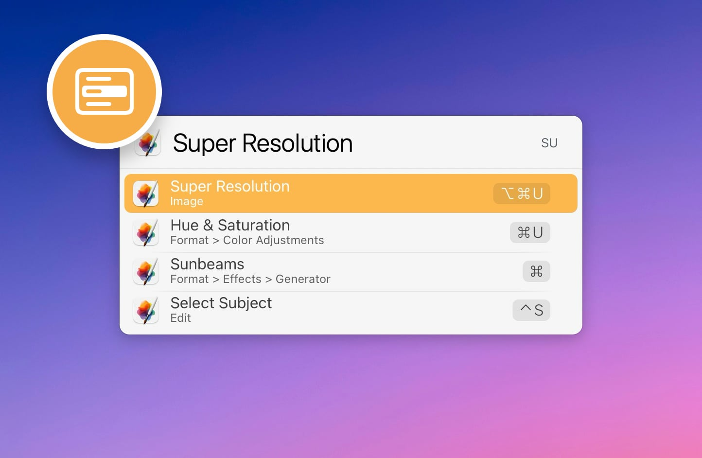

# LaunchBar Action: Menus

*[→ See a list of all my actions here.](https://ptujec.github.io/launchbar)* 

 

This action allows listing and triggering [menu items](https://developer.apple.com/design/human-interface-guidelines/components/system-experiences/the-menu-bar) of the current application right from within LaunchBar. 

The benefit of this vs. using the Help shortcut is that it utilizes a superpower of LaunchBar: **adaptive abbreviations**. This makes it easy to find the right menu with just a few keystrokes. 

The action also remembers the **last used item** per application. So if you want to trigger the same menu item again next time around, it's right there for you at the top of the list. 

**NOTE:** The Apple menu path is excluded by default. You can manage this and other exclusions in the `config` section in the actions `preferences.plist` (see below).

## Setup (IMPORTANT!)

**In order to run smoothly, actions written in Swift need to be both "un-quarantined" and compiled. I made [a dedicated action that does both](https://github.com/Ptujec/LaunchBar/tree/master/Compile-Swift-Action#readme). Run the `.lbaction` bundle of this action through the compile action before you start using it.**

## Configuration (Advanced)

You can manage excluded menu paths or individual items by editing the `config` section in the actions `preferences.plist`. For example, "History" excludes showing browser history items. Exclusions can be configured either globally or by App ([bundle ID](https://github.com/Ptujec/LaunchBar/tree/master/Get-App-ID#launchbar-action-get-app-id)).  

Just hold `command` while launching the action. This automatically opens the plist in your default editor, so you can tinker away. If something goes wrong, the plist will be reset by the action.

```
<plist version="1.0">
<dict>
	<key>config</key>
	<dict>
		<key>appMenuExclusions</key>
		<dict>
			<key>org.mozilla.firefox</key>
			<array>
				<string>Chronik</string>
			</array>
		</dict>
		<key>globalMenuExclusions</key>
		<array>
			<string>Open Recent</string>
			<string>Services</string>
			<string>History</string>
		</array>
	</dict>
	<key>recentItems</key>
	<array/>
</dict>
</plist>
```

## Nitty Gritty Details

If you launch a menu item, after performing the action, the LB interface will not refresh automatically. This is especially relevant for [toggled items](https://developer.apple.com/design/human-interface-guidelines/menus#Toggled-items). If you bring up LB again, the changed state is not reflected until you use the action again. You can probably reuse the item without refreshing. Just be aware that it does the opposite of what it says.  

## Alternatives 

If you want a global hotkey and even more granular control, check out [Finbar](https://www.roeybiran.com/apps/finbar). It is a great standalone app by a longtime [LaunchBar user](https://github.com/roeybiran/launchbar-actions).

## Download & Update

[Click here](https://github.com/Ptujec/LaunchBar/archive/refs/heads/master.zip) to download this LaunchBar action along with all the others. Or simply use [LaunchBar Repo Updates](https://github.com/Ptujec/LaunchBar/tree/master/LB-Repo-Updates#launchbar-repo-updates-action)! It helps automate updating existing and installing new actions.