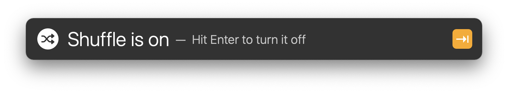
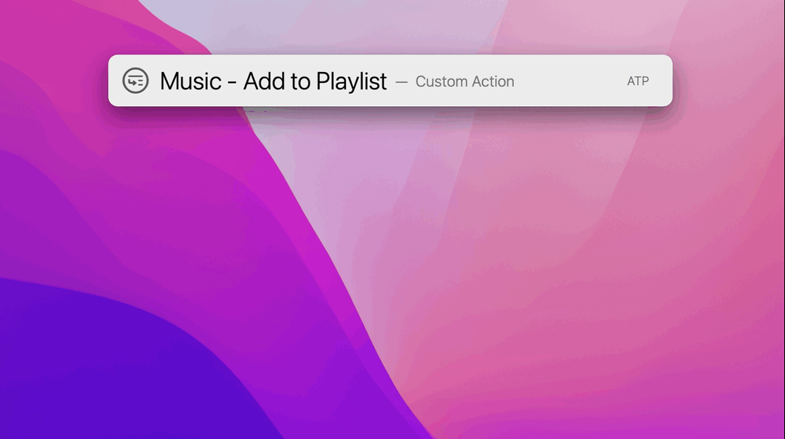
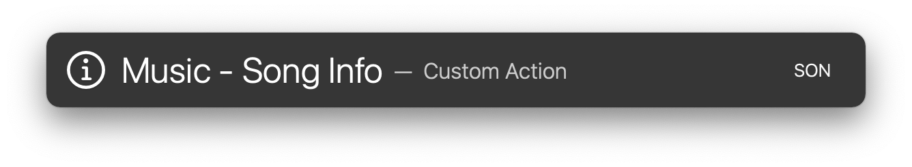
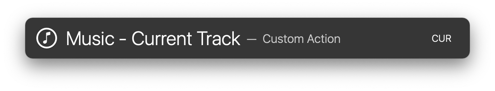
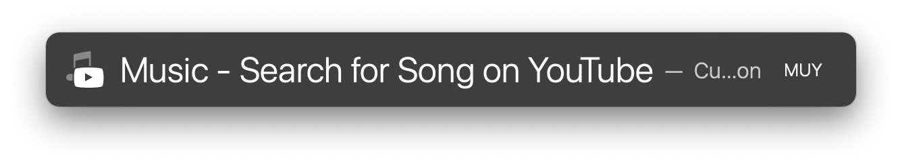

# LaunchBar Action: Music Actions

## Shuffle

 

## Like/Dislike

 

## Repeat

 

## Add to Playlist

I wish Apple would have better support for this in AppleScript. But with some GUI scripting it is possible to add the currently playing song to a playlist of your choice. 
The implementation is not ideal and you may see some stuff going on in the background. But at least it does work.

 

## Fade In/Out

 

## Fade to Next Song

 

## Song Info

Shows notification with artist and song title.

 

## Current Track

Go to current track in Music.

 

## Search for Song on YouTube

## Download

[Download LaunchBar Action: Music Actions](https://minhaskamal.github.io/DownGit/#/home?url=https://github.com/Ptujec/LaunchBar/tree/master/Music-Actions) (powered by [DownGit](https://github.com/MinhasKamal/DownGit))