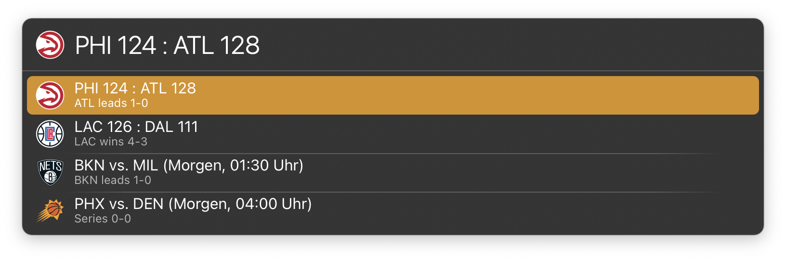

# LaunchBar Action: NBA Scoreboard
 

## Features
This action lets you check NBA scores really quick. 
- Per default it displays games from yesterday and today 
- Enter days from now (e.g. "-3" or "2") to look up games from the past or games scheduled in the near future
- The icon displayed in LaunchBar is either the one from the winning team or the home team, if the game has not started yet
- Dates and times for scheduled games are translated to your timezone
- You can press enter to go to the boxscore of a selected game on nba.com
- ⌘⏎ will go straight to the NBA Scoreboard page on ESPN.com without showing the scores in LaunchBar first

## Download

[Download LaunchBar Action: NBA Scoreboard](https://minhaskamal.github.io/DownGit/#/home?url=https://github.com/Ptujec/LaunchBar/tree/master/NBA-Scoreboard) (powered by [DownGit](https://github.com/MinhasKamal/DownGit))