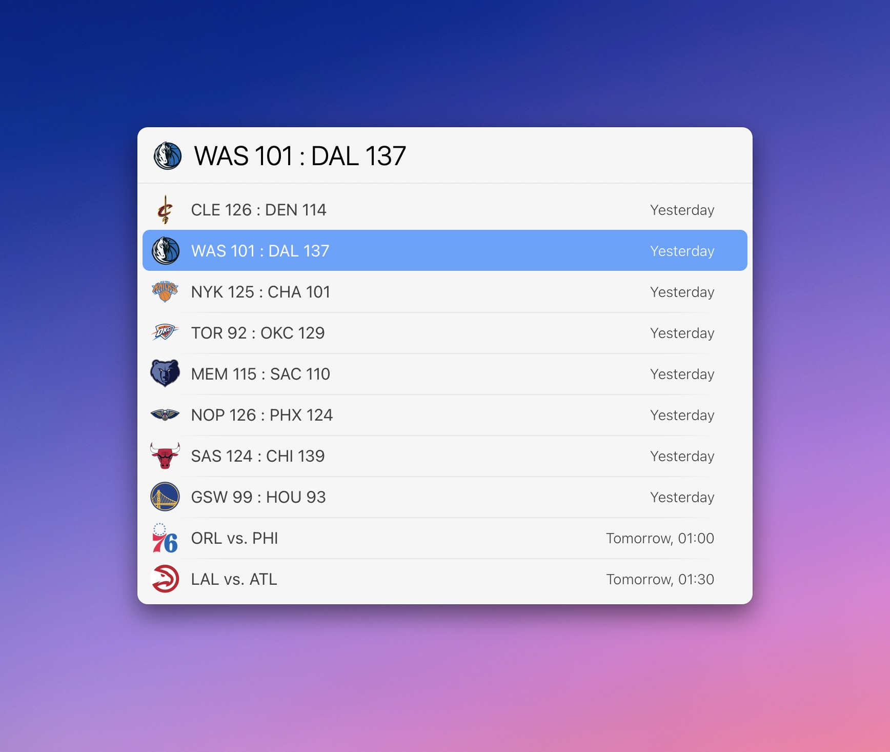
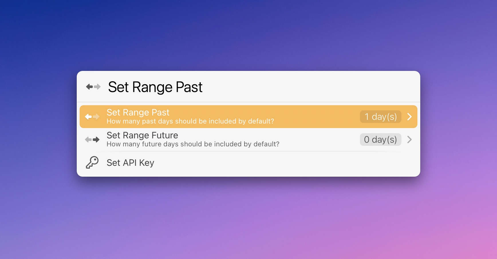

# LaunchBar Action: NBA Scoreboard 

This action is mainly for checking the scores of completed and upcoming NBA games. It is powered by https://www.balldontlie.io.

 

## Features

- By default, the action displays games from yesterday and today.
- Enter days from now (e.g., "-3" or "2") or an upcoming weekday ("Sunday" or "sun") to look up games from the past or games scheduled in the near future.
- The icon displayed in LaunchBar is either the one from the winning team or the home team if the game has not started yet.
- Dates and times for scheduled games are translated to your time zone.
- You can press Enter `↩` to check YouTube for a game recap of the selected game when completed. If the game is still ongoing, it should lead you to NBA.com so you can watch it via League Pass. *(This uses DuckDuckGo and might not always be reliable.)*
- Hold `command` and press enter `↩` to go to the summary of a selected game on espn.com. *(This uses DuckDuckGo and might not always be reliable)*

## Settings

If you hold `option` and press enter `↩` on the top level, you can tweak how many days in the past and future are included. You can also (re)set your API key there. 

 

## API Key required

This action requires an API key. There is a free tier that should work fine for this action.

Go to https://www.balldontlie.io to create your account and get your key.

You will be prompted to set the API key automatically. You can also manually reset the API key in the settings (`option` + `↩`).

## Download & Update

[Click here](https://github.com/Ptujec/LaunchBar/archive/refs/heads/master.zip) to download this LaunchBar action along with all the others. Or simply use [LaunchBar Repo Updates](https://github.com/Ptujec/LaunchBar/tree/master/LB-Repo-Updates#launchbar-repo-updates-action)! It helps automate updating existing and installing new actions.