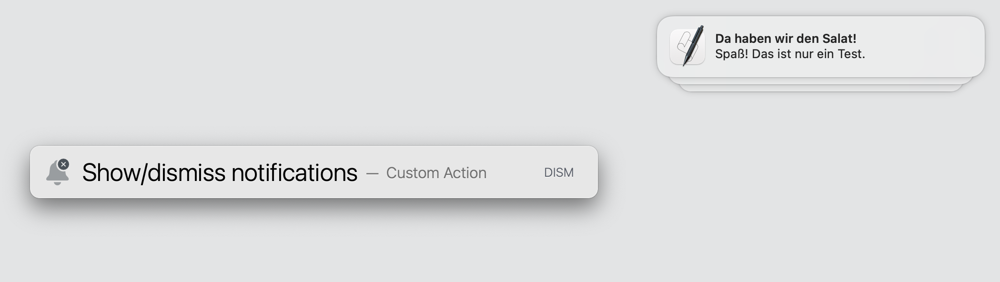
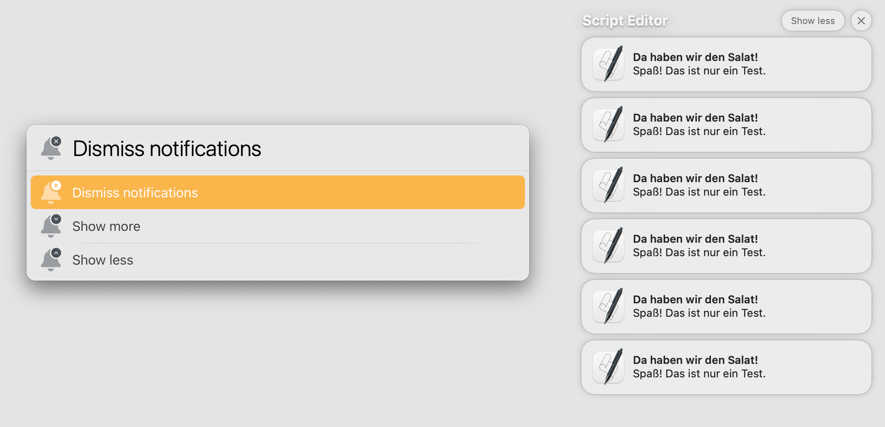

# LaunchBar Actions for Managing Notifications

 

 

*Note: The following actions work for german and english user interfaces only.* 

## Action: Dismiss All Notifications

Dismiss all notifications, no matter if they are grouped or not.

## Action: Show/Dismiss Notifications

This will dismiss all notifications unless there is a group of notifications. If there is a group of notifications, it will show them along with a few options. 

## Download
[Download LaunchBar Actions for Managing Notifications](https://minhaskamal.github.io/DownGit/#/home?url=https://github.com/Ptujec/LaunchBar/tree/master/Notifications) (powered by [DownGit](https://github.com/MinhasKamal/DownGit))