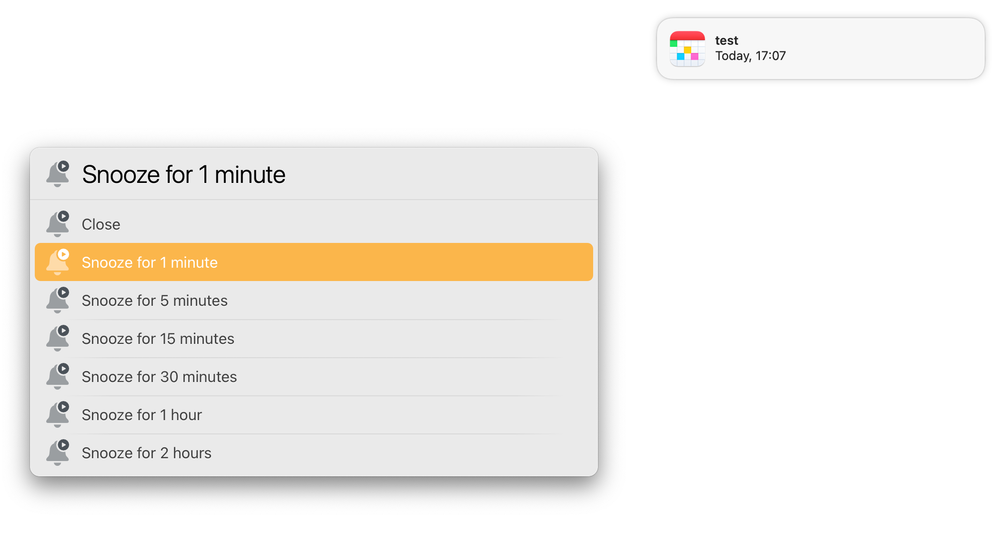
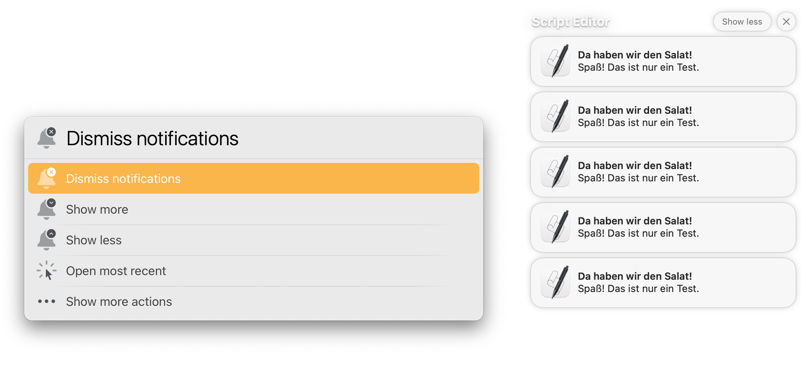

# LaunchBar Actions for Managing Notifications

*Note: Make sure to install the set of actions that is compatible with the macOS version you are currently using.*

## Action: Notification Actions

Let's you run actions of the most recent notification (group). 

 
 
## Action: Show/Dismiss Notifications

This will dismiss all notifications unless there is a group of notifications. If there is a group of notifications, it will show them as well as offer a few action options. 

 

## Action: Dismiss All Notifications

Dismiss all notifications, no matter if they are grouped or not.

## Action: Open Notification

Opens the most recent notification.

## Download & Update

[Click here](https://github.com/Ptujec/LaunchBar/archive/refs/heads/master.zip) to download this LaunchBar action along with all the others. Or simply use [LaunchBar Repo Updates](https://github.com/Ptujec/LaunchBar/tree/master/LB-Repo-Updates#launchbar-repo-updates-action)! It helps automate updating existing and installing new actions.
