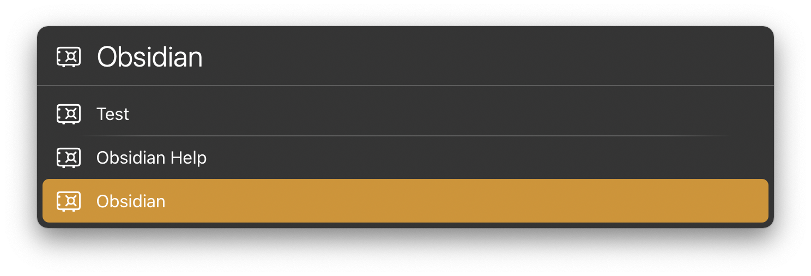
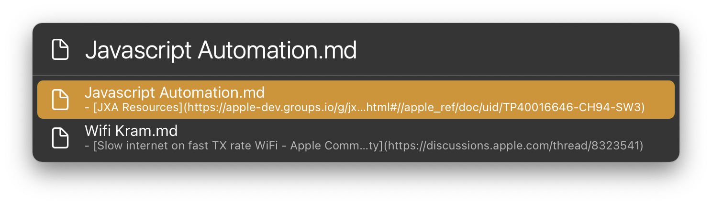

# LaunchBar Actions for Obsidian

## New Obsidian Note

**Note**: I am not a regular Obsidian user. Let me know if you run into issues or you would expect the actions to work differently.

 
 
 
 

## Search Obsidian

 
 
 

You can either choose a vault to search in or search in all vaults (default, slow if you have a lot of vaults).

 

## Obsidian - Vaults and Notes
This action is associated with the Obsidian application on your Mac. This means you can press space when the App is selected to see all your vaults. 

 

Press enter to see all the documents in a vault. 

 

You can use ← to go back to your vaults.

## Download & Update

[Click here](https://github.com/Ptujec/LaunchBar/archive/refs/heads/master.zip) to download this LaunchBar action along with all the others. Or simply use [LaunchBar Repo Updates](https://github.com/Ptujec/LaunchBar/tree/master/LB-Repo-Updates#launchbar-repo-updates-action)! It helps automate updating existing and installing new actions.