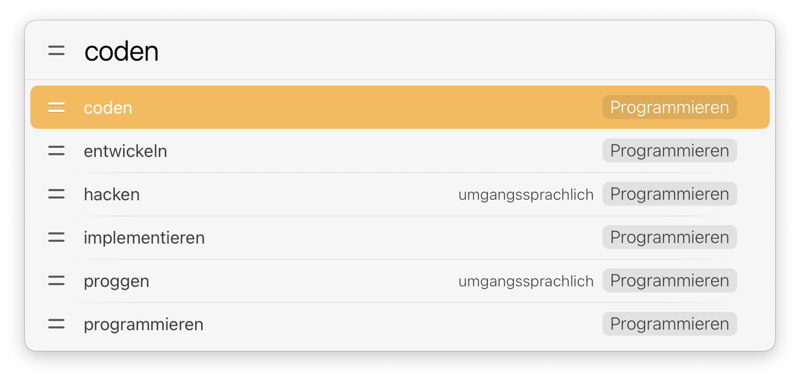

# LaunchBar Action: OpenThesaurus.de

 

This action searches [OpenThesaurus.de](https://github.com/danielnaber/openthesaurus#license). Suggestions are from 
[https://dict.leo.org](https://www.leo.org). 

## Download

[Click here](https://github.com/Ptujec/LaunchBar/archive/refs/heads/master.zip) to download this LaunchBar action along with all the others. Or [clone](https://docs.github.com/en/repositories/creating-and-managing-repositories/cloning-a-repository) this repository.

## Updates

Use [Local Action Updates](https://github.com/Ptujec/LaunchBar/tree/master/Local-Action-Updates#launchbar-action-local-action-updates) to keep track of new versions of all my actions and discover new ones at the same time. 

This action also supports [Action Updates](https://github.com/prenagha/launchbar) by Padraic Renaghan.