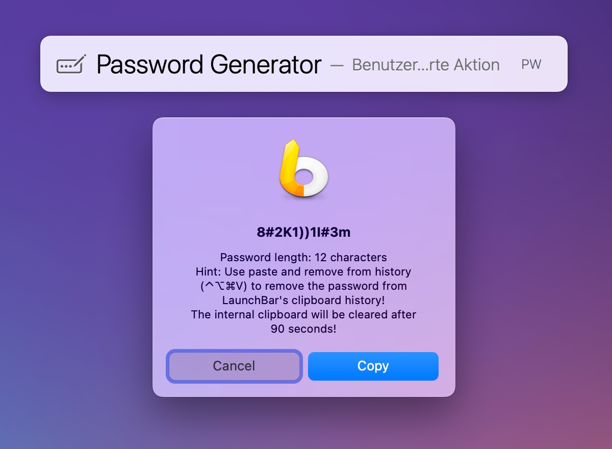
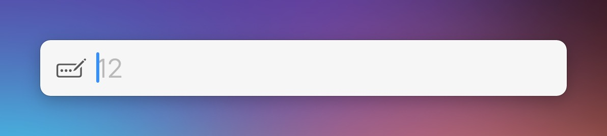
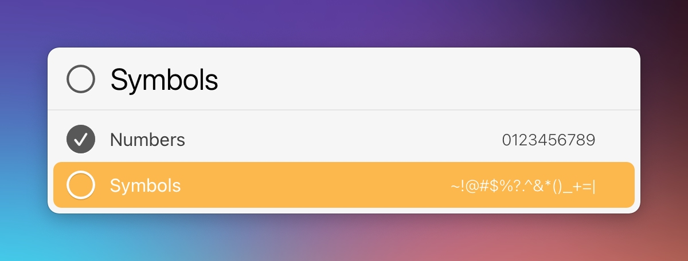

# LaunchBar Action: Password Generator

Password managers usually cover the need to generate passwords. But every now and then there might be a case where your password manager doesn't work for some reason or it is just easier to do it with a LaunchBar action. 

Per default this action generates a random 12 character long password with lower and upper case letters, numbers and symbols. 

 

You can change the length with `␣` (space).

With `⇧↩` (shift-return) you can change defaults for numbers and symbols, that is if they should be included or not.

## Clear Clipboard Action

I included a complimentary action that clears the internal clipboard (not LaunchBars clipboard history) after a delay of 90 seconds. The main action runs that automatically, when installed. It needed to be an extra action in order to run in the background. Otherwise you would not be able to use LaunchBar again until the delay time has passed.

## Clipboard History

You might want to use paste and remove from history `⌃⌥⌘V` to remove the password from LaunchBar's Clipboard History! 

## Download

[Download LaunchBar Action: Password Generator (incl. Clear Clipboard Action)](https://minhaskamal.github.io/DownGit/#/home?url=https://github.com/Ptujec/LaunchBar/tree/master/Password-Generator) (powered by [DownGit](https://github.com/MinhasKamal/DownGit))

## Updates

This action integrates with Action Updates by @prenagha. You can find the [latest version in his Github repository](https://github.com/prenagha/launchbar). For more information and a signed version of Action Updates [visit his website](https://renaghan.com/launchbar/action-updates/).