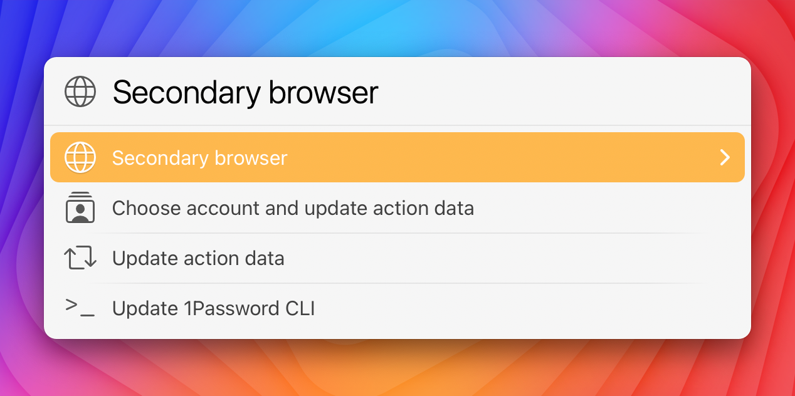

# LaunchBar Action: Passwords for 1Password 8

*[→ See a list of all my actions here.](https://ptujec.github.io/launchbar)* 

After a little setup ([see below](#setup)) you can view a list of all your login and other items from 1Password 8 in LaunchBar. 

## Features 

- You can view items also when 1Password is selected simply by pressing <kbd>space</kbd> or <kbd>→</kbd>. 
- Login items will open and autofill by default in your default browser (as long as they have an URL). 
- Other items will open in 1Password by default. 
- You can alter the default behavior with <kbd>⌘</kbd> + <kbd>↩</kbd> . 
- You can open login items in a secondary browser with <kbd>⌥</kbd> + <kbd>↩</kbd> . (Other items that contain an URL with `⌥⌘↩`.) 

## Settings 

In action settings you can choose a secondary browser and refresh data. Access the settings by selecting the action and then press <kbd>⌥</kbd> + <kbd>↩</kbd> .

## Setup

This action requires 1Password's CLI. [Learn how to install and set it up on their website!](https://developer.1password.com/docs/cli/get-started#install) 
Follow the "Install" instructions and also make sure you do step 1 of "Sign in".

**Note:** The data received from the CLI does not contain any passwords or secure information. You can enter `op item list --format=json` in the Terminal to see what data is retrieved. For performance reasons the output is stored in the action's support folder (converted to a Base64 String), which can be found in `~/Library/Application Support/LaunchBar/Action Support/`.

## Limitations

- The action does not copy any passwords. In theory it would be possible to copy passwords to the clipboard. But those would also appear in your clipboard history. You would need to exclude LaunchBar from the clipboard history to prevent that. But this in turn would effect every other built in or custom action. 
- Because this is just a standard user action there is no indexing going on in the background. You need to refresh data manually in the action settings. <kbd>⌥</kbd> + <kbd>↩</kbd> . Access the settings by selecting the action and then press <kbd>⌥</kbd> + <kbd>↩</kbd> .
- You need to be signed-in either in the CLI or 1Password for autofill to work. You get a prompt if that is not the case. But it may still fail if you use it for the first time after a sign-in. Just open the item again. It should be still selected in LaunchBar. (The 1Password team is looking into this issue.)  

## Download & Update

[Click here](https://github.com/Ptujec/LaunchBar/archive/refs/heads/master.zip) to download this LaunchBar action along with all the others. Or simply use [LaunchBar Repo Updates](https://github.com/Ptujec/LaunchBar/tree/master/LB-Repo-Updates#launchbar-repo-updates-action)! It helps automate updating existing and installing new actions.
