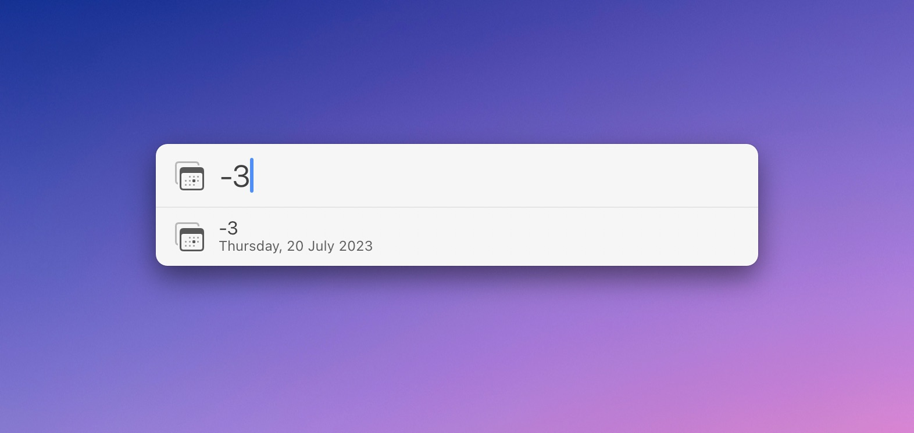
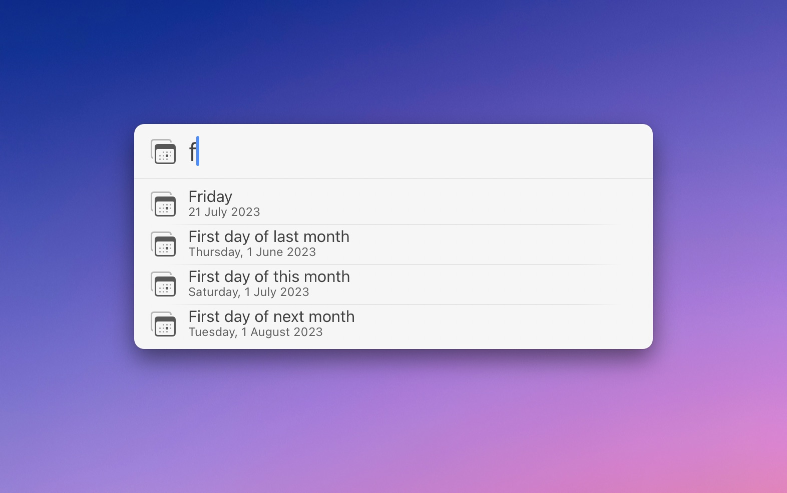
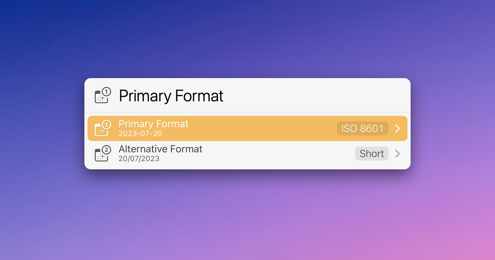

# LaunchBar Action: Paste Date

*[→ See a list of all my actions here.](https://ptujec.github.io/launchbar)* 

This is a simple action that lets you paste the date in an active text field. If you hit <kbd>enter</kbd>, the date will be the **current date**. 

But you can **modify** the date when you hit <kbd>space</kbd> instead. One way you can modify the date is to **enter a number** to get the current date plus the number of days. This can also be a negative number.

Another way to modify the date is to **specify a day** by its name. You will be presented with a few common options as well as some more advanced ones. 

**Note:** You don't need to write out the full name for weekdays. In the example in the screenshot, "f" is enough to paste the date for the upcoming Friday.

## Format settings

In settings (<kbd>shift</kbd> + <kbd>enter</kbd>), you can set a default (primary) and an alternative format style for your dates.

You can choose from different local date format styles (short, medium, long, and full) as well as ISO 8601 (yyyy-MM-dd). 

When you use the action, you can access the alternative format with <kbd>option</kbd> + <kbd>enter</kbd>. Or you can choose from all the available styles with <kbd>command</kbd> + <kbd>enter</kbd>.

**Note:** Local date format styles are defined by the system. As of macOS Ventura, the only style you can modify seems to be "short" (`System Settings → Language & Region → Date format`). 
You can try [tweaking the others in the Terminal](https://www.caseyliss.com/2022/11/14/ventura-date-formats). 

## Download & Update

[Click here](https://github.com/Ptujec/LaunchBar/archive/refs/heads/master.zip) to download this LaunchBar action along with all the others. Or simply use [LaunchBar Repo Updates](https://github.com/Ptujec/LaunchBar/tree/master/LB-Repo-Updates#launchbar-repo-updates-action)! It helps automate updating existing and installing new actions.