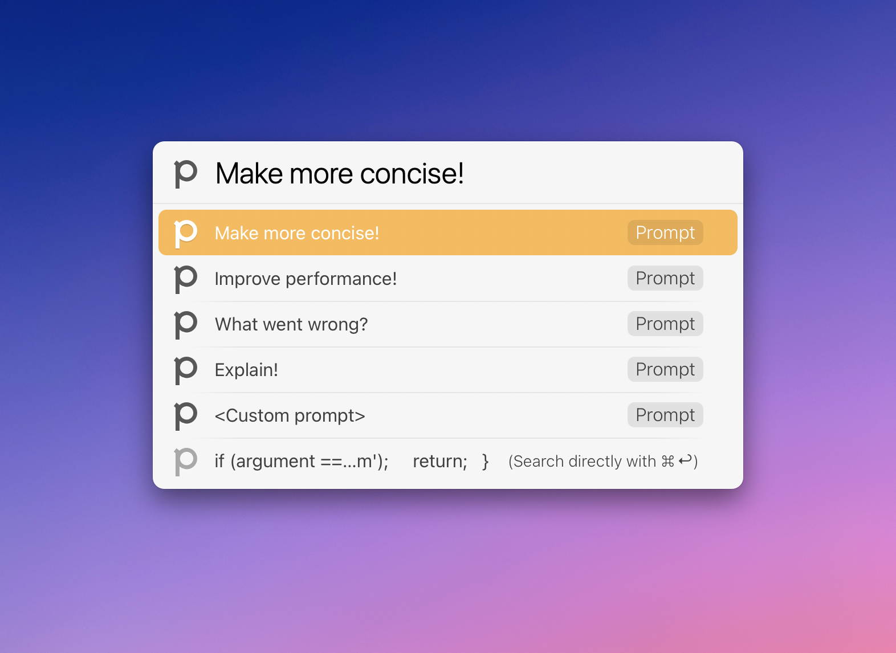

# LaunchBar Action for Phind

[Phind](https://www.phind.com/) is an AI search engine optimized for developers and technical questions. 

This action is designed to be used with "[Instant Send](https://www.obdev.at/resources/launchbar/help/InstantSend.html)". Send code to it and you will be provided with a few common prompts to make using Phind even easier. 

 

So, by design, the common entry for this action is code. But if you want to enter a question you can skip the prompts with `command` + `return`. Or, if you forget, you can always use the option at the bottom of the list.

## Download

[Click here](https://github.com/Ptujec/LaunchBar/archive/refs/heads/master.zip) to download this LaunchBar action along with all the others. Or [clone](https://docs.github.com/en/repositories/creating-and-managing-repositories/cloning-a-repository) this repository.

## Updates

This action integrates with Action Updates by @prenagha. You can find the [latest version of Action Updates in his Github repository](https://github.com/prenagha/launchbar). For more information and a signed version of Action Updates [visit his website](https://renaghan.com/launchbar/action-updates/).

