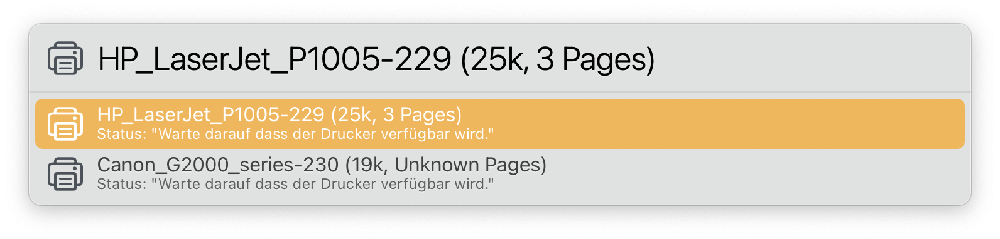
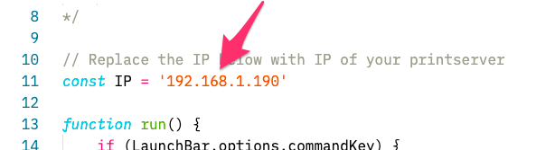

# LaunchBar Action: Print jobs (CUPS Server)

 

 

This action comes in handy, if you are using a [Raspberry Pi as a print server](https://www.tomshardware.com/how-to/raspberry-pi-print-server) and you want to check the currently active print jobs. 

## Installation Note 
Enter the [IP of your printserver](https://www.raspberrypi.org/documentation/remote-access/ip-address.md) in default.js before you start using this action. 

 

## Download

[Download LaunchBar Action: Print jobs (CUPS Server)](https://minhaskamal.github.io/DownGit/#/home?url=https://github.com/Ptujec/LaunchBar/tree/master/Print-jobs) (powered by [DownGit](https://github.com/MinhasKamal/DownGit))