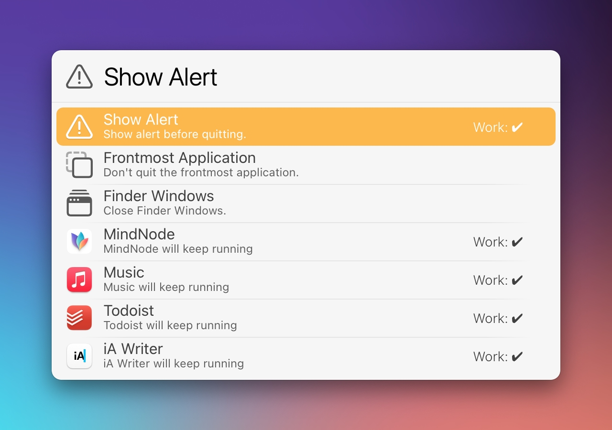

# LaunchBar Action: Quit Applications (by Context)

 

The purpose of this action is to **limit distraction by quitting apps** that are not needed for what you are currently doing. 
You can set up **custom contexts** like e.g. "Work", "Meeting", etc. 
You can even pick custom emojis in a plain text file `⇧⏎`. 

   

For each context you can specify apps that are necessary in that context. The action will quit all other apps. This applies only to apps that show up in the application switcher `⌘⇥`. LaunchBar and Finder are also excluded. 

   

There are some additional options you can configure for each context: 
- Show Alert before quitting
- Don't quit frontmost application
- Close Finder windows

## Download

[Download LaunchBar Action: Quit Applications (by Context)](https://minhaskamal.github.io/DownGit/#/home?url=https://github.com/Ptujec/LaunchBar/tree/master/Quit-Applications) (powered by [DownGit](https://github.com/MinhasKamal/DownGit))

## Updates

This action integrates with Action Updates by @prenagha. You can find the [latest version in his Github repository](https://github.com/prenagha/launchbar). For more information and a signed version of Action Updates [visit his website](https://renaghan.com/launchbar/action-updates/).

