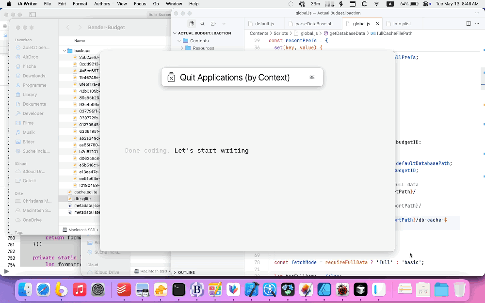

# LaunchBar Action: Quit Applications (by Context)

*[→ See a list of all my actions here.](https://ptujec.github.io/launchbar)* 

 

The purpose of this action is to **limit distractions by quitting apps** that are not needed for what you are currently doing. 
You can set up **custom contexts** like e.g. "Work", "Meeting", etc. in a plain text file, which will open on first launch or if you press `⇧⏎`. You can even pick an emoji to be displayed as the icon for your context. 

   

For each context you can specify apps that are necessary in that context. The action will quit all other apps. This applies only to apps that show up in the application switcher `⌘⇥`. LaunchBar and Finder are also excluded. 

   

There are some additional options you can configure for each context: 
- Show Alert before quitting
- Close Finder windows
- Don't quit frontmost application 

<svg xmlns="http://www.w3.org/2000/svg" id="new-icon" viewBox="0 0 28 19" width="28" height="19"><g transform="matrix(1.31579,0,0,1.31579,-2.44737,0)"><g transform="matrix(1.12,0,0,1,1.86,0)"><path d="M19,4.75c0,-2.622 -1.9,-4.75 -4.241,-4.75l-10.518,0c-2.341,0 -4.241,2.128 -4.241,4.75c0,2.622 1.9,4.75 4.241,4.75l10.518,0c2.341,0 4.241,-2.128 4.241,-4.75Z" style="fill:#007aff;"/></g><g transform="matrix(0.76,0,0,0.76,3,6.75016e-16)"><path d="M4.694,8.347c0,0.603 -0.308,0.951 -0.84,0.951c-0.537,-0 -0.854,-0.357 -0.854,-0.951l0,-4.093c0,-0.695 0.299,-1.052 0.88,-1.052c0.374,0 0.59,0.15 0.946,0.656l1.607,2.293l0.07,-0l0,-1.998c0,-0.603 0.308,-0.951 0.837,-0.951c0.537,0 0.858,0.352 0.858,0.951l-0,4.159c-0,0.643 -0.286,0.986 -0.828,0.986c-0.387,-0 -0.629,-0.159 -0.985,-0.674l-1.62,-2.328l-0.071,0l0,2.051Zm4.516,-0.026l0,-4.137c0,-0.581 0.352,-0.938 0.924,-0.938l2.822,0c0.391,0 0.673,0.299 0.673,0.713c-0,0.414 -0.282,0.709 -0.673,0.709l-1.919,-0l-0,0.946l1.844,0c0.356,0 0.598,0.264 0.598,0.647c0,0.383 -0.242,0.638 -0.598,0.638l-1.844,0l-0,0.933l1.892,0c0.418,0 0.7,0.286 0.7,0.713c-0,0.427 -0.282,0.709 -0.704,0.709l-2.791,-0c-0.572,-0 -0.924,-0.352 -0.924,-0.933Zm5.902,0.101l-1.069,-3.759c-0.066,-0.228 -0.102,-0.462 -0.102,-0.616c0,-0.502 0.361,-0.845 0.885,-0.845c0.489,0 0.766,0.299 0.915,0.982l0.595,2.706l0.083,0l0.656,-2.746c0.163,-0.673 0.423,-0.942 0.911,-0.942c0.489,0 0.766,0.282 0.924,0.942l0.656,2.746l0.088,0l0.546,-2.706c0.132,-0.669 0.431,-0.982 0.929,-0.982c0.515,0 0.871,0.339 0.871,0.828c0,0.158 -0.026,0.382 -0.062,0.501l-1.074,3.891c-0.162,0.585 -0.514,0.876 -1.065,0.876c-0.581,-0 -0.963,-0.282 -1.135,-0.938l-0.638,-2.411l-0.066,-0l-0.656,2.473c-0.15,0.559 -0.537,0.876 -1.074,0.876c-0.541,-0 -0.933,-0.22 -1.118,-0.876Z" style="fill:#fff;"/></g></g></svg> Additionally you can always protect the frontmost application with `⌘↩`, even if you have not set it as the default behavior for the context.

## Download

[Download LaunchBar Action: Quit Applications (by Context)](https://minhaskamal.github.io/DownGit/#/home?url=https://github.com/Ptujec/LaunchBar/tree/master/Quit-Applications) (powered by [DownGit](https://github.com/MinhasKamal/DownGit))

## Updates

This action integrates with Action Updates by @prenagha. You can find the [latest version in his Github repository](https://github.com/prenagha/launchbar). For more information and a signed version of Action Updates [visit his website](https://renaghan.com/launchbar/action-updates/).

