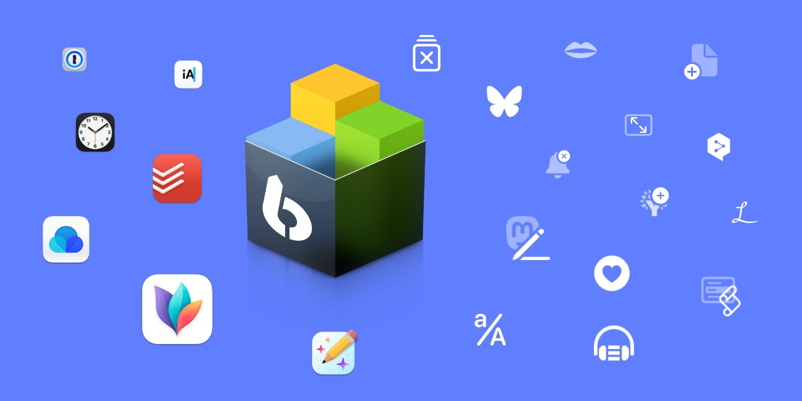
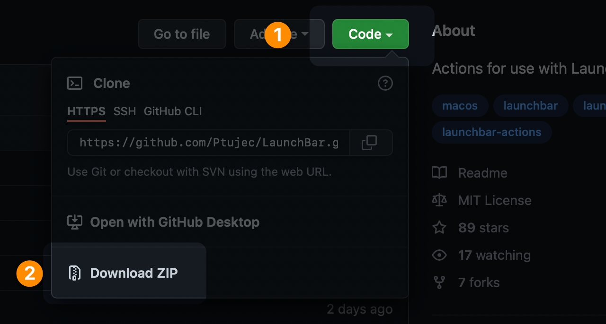

# LaunchBar Actions

 

## Download 
You can download the [whole repository](https://github.com/Ptujec/LaunchBar/archive/refs/heads/master.zip) …

 

… or any of the directories separately. **There are download links in the readme of each directory.**  

## Installation
The actions in this repository are created for use with [LaunchBar](http://www.obdev.at/products/launchbar/). After downloading and unzipping just double click the `.lbaction` packages you want to use to install them.  

## Updates

Actions and updates uploaded after 2022/1 integrate with Action Updates by [@prenagha](https://github.com/prenagha). You can find the [latest version in his Github repository](https://github.com/prenagha/launchbar). For more information and a signed version of Action Updates [visit his website](https://renaghan.com/launchbar/action-updates/).

## Action icons
I use Apples [SF Symbols](https://developer.apple.com/sf-symbols/) to create most of the icons for my actions. It's fairly easy with some tool like Affinity Designer or Pixelmator Pro. They look best if you use simple black vector shapes or text (because that what the symbols are). You can play with the opacity though. Make sure the name ends with "Template" (e.g. IconTemplate.pdf) for LaunchBar to catch it … so they fit in nicely.

To use the icon of an application it is best to use the App ID. There is an [action to easily get the ID of an app](https://github.com/Ptujec/LaunchBar/tree/master/Get-App-ID) in this repository.

