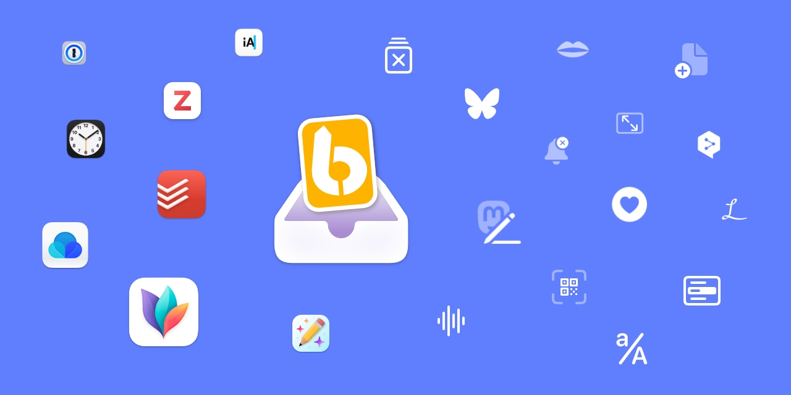

# LaunchBar Actions

 

[→ Go to my website to view a curated list of my actions.](https://ptujec.github.io/launchbar.html)

## Installation
You can download the [whole repository](https://github.com/Ptujec/LaunchBar/archive/refs/heads/master.zip) or any of the directories separately. **There are download links in the readme of each directory.**  

After downloading and unzipping just double click the `.lbaction` packages you want to use to install them.  

## Updates

Actions and updates uploaded after 2022/1 integrate with Action Updates by [@prenagha](https://github.com/prenagha). You can find the [latest version in his Github repository](https://github.com/prenagha/launchbar). For more information and a signed version of Action Updates [visit his website](https://renaghan.com/launchbar/action-updates/).

## Support

