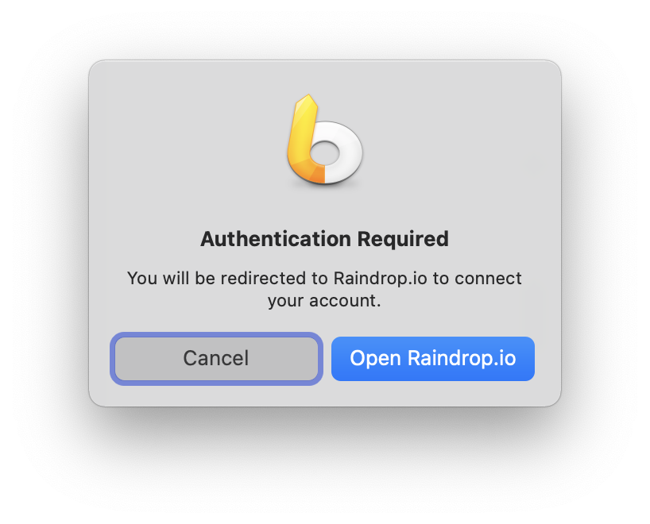

# LaunchBar Actions for Raindrop.io

## Action: Raindrops (Browse and Search Raindrop.io)
 
 
 
This actions lets you browse or search your bookmarks from Raindrop.io.

Options:

1. ⏎ = Browse recent items
2. Space = Enter search term (⇧⏎ = Search only within tags) 
3. ⌘⏎ = Open the app

## Action: Save Raindrop (Save current website to Raindrop.io)

 

 

This action lets you save the current website in your browser to Raindrop.io. Press space before you hit return to add as many tags as you like (separated by commas). You can also hit return on the confirmation to see the entry in the Raindrop.io app (or webapp). 

Supported browsers: Safari, Brave, Chromium, Chrome, Edge, Vivaldi

## First run
 

When you run the action for the first time you will be redirected to Raindrop.io to connect your account.

## Download

[Download LaunchBar Actions for Raindrop.io](https://minhaskamal.github.io/DownGit/#/home?url=https://github.com/Ptujec/LaunchBar/tree/master/Raindrop-Actions) (powered by [DownGit](https://github.com/MinhasKamal/DownGit))