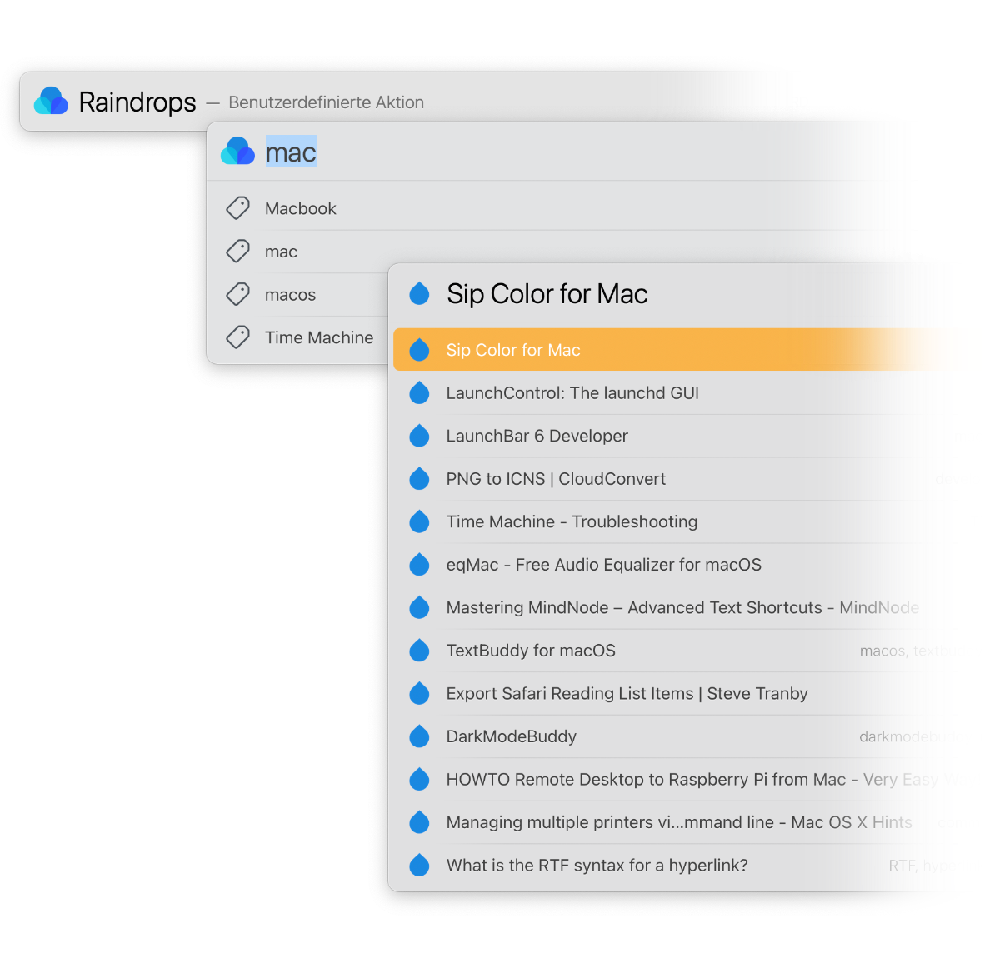
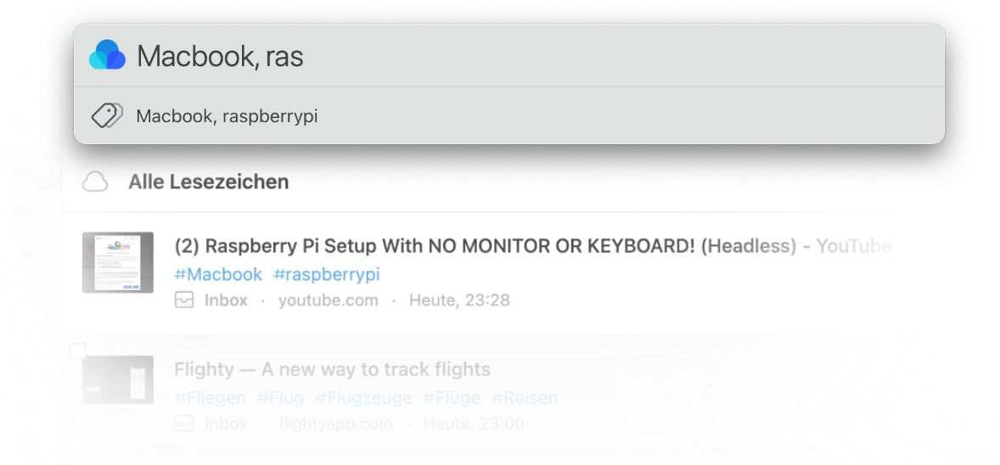
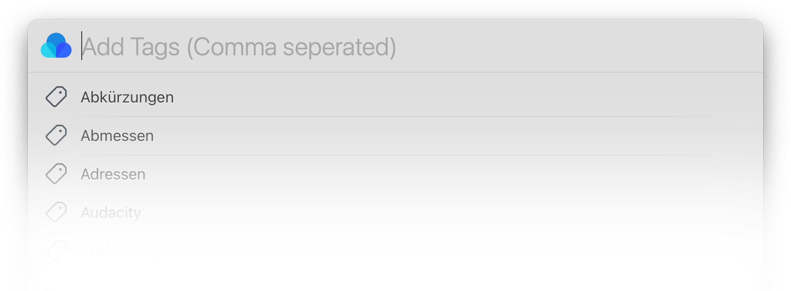
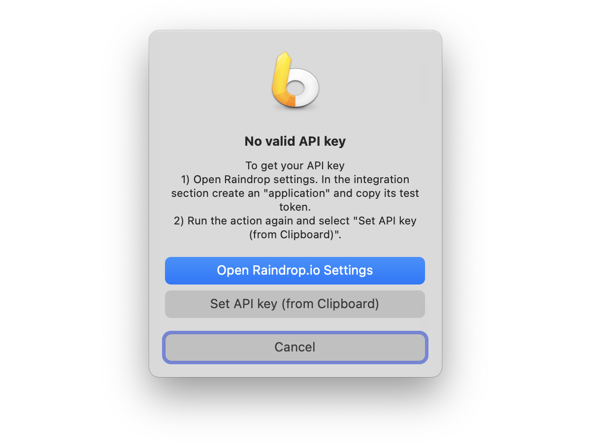
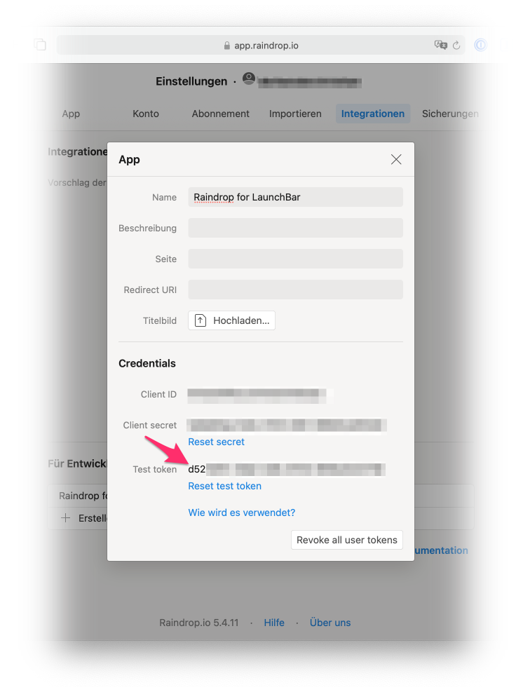

# LaunchBar Action: Raindrops (Raindrop.io)

## Raindrops (Browse and Search Raindrop.io)
 
 
 
This actions lets you browse or search your bookmarks from Raindrop.io.

Options:

1. ⏎ = Browse recent items
2. Space = Enter search term (⇧⏎ = Search only within tags) 
3. ⌘⏎ = Open the app

## Save Raindrop (Save current website in Safari to Raindrop.io)

 

 

This action lets you save the current website in Safari to Raindrop.io. Press space before you hit return to add as many tags as you like (separated by commas). 

You can hit return on the confirmation to see the entry in the Raindrop.io app (or webapp).  

## First run
 

When you run the aciton for the first time you will be notice that you need an API key. 

Step 1: Open Raindrop settings. In the integration section create an "application" and copy its test token. 

Step 2: Run the action again and select "Set API key (from Clipboard)"

 

## Download

[Download Raindrop.io Actions for LaunchBar](https://minhaskamal.github.io/DownGit/#/home?url=https://github.com/Ptujec/LaunchBar/tree/master/Raindrop-Actions) (powered by [DownGit](https://github.com/MinhasKamal/DownGit))