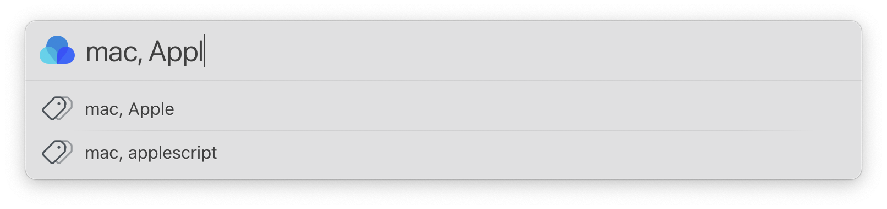
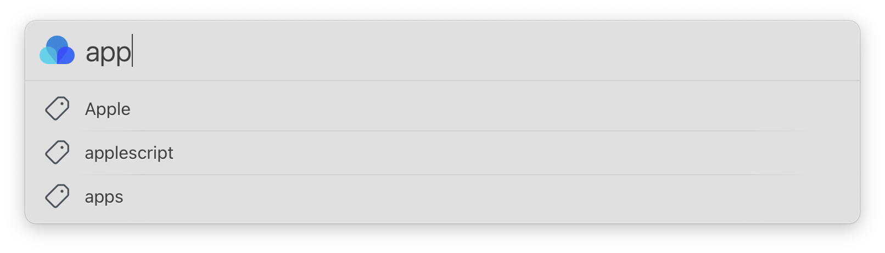
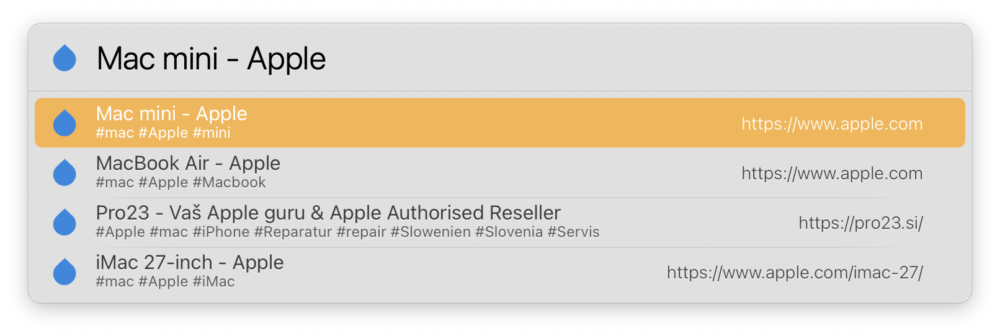
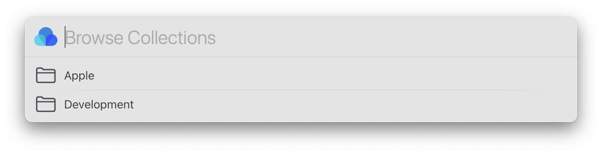
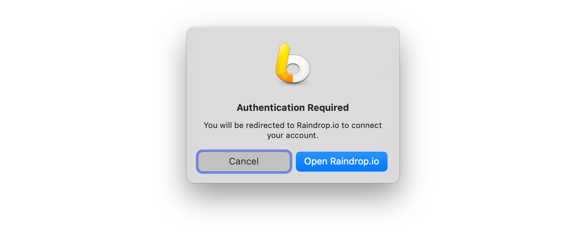

# LaunchBar Actions for Raindrop.io

## Action: Save Raindrop (Save current website to Raindrop.io)

 

 

This action lets you save the current website in your browser to Raindrop.io. Press space before you hit return to add as many tags as you like (separated by commas). You can also hit return on the confirmation to see the entry in the Raindrop.io app (or webapp). 

Supported browsers: Safari, Brave, Chromium, Chrome, Edge, Vivaldi

## Action: Raindrops (Browse and Search Raindrop.io)
 
 

 
 
This actions lets you browse or search your bookmarks on Raindrop.io.

Options:

1. ⏎ = Browse recent items
2. Space = Enter search term/tag (⇧⏎ = Search all text) 
3. ⌘⏎ = Open the app

## Action: Raindrop Collections (Show all bookmarks of a selected Raindrop.io collection)

 

With this action you can browse your bookmarks by collection.

## First run
 

When you run one of these actions for the first time you will be redirected to Raindrop.io to connect your account. Thanks to [@mlinzner](https://github.com/mlinzner) for the OAuth integration.

## Download

[Download LaunchBar Actions for Raindrop.io](https://minhaskamal.github.io/DownGit/#/home?url=https://github.com/Ptujec/LaunchBar/tree/master/Raindrop-Actions) (powered by [DownGit](https://github.com/MinhasKamal/DownGit))