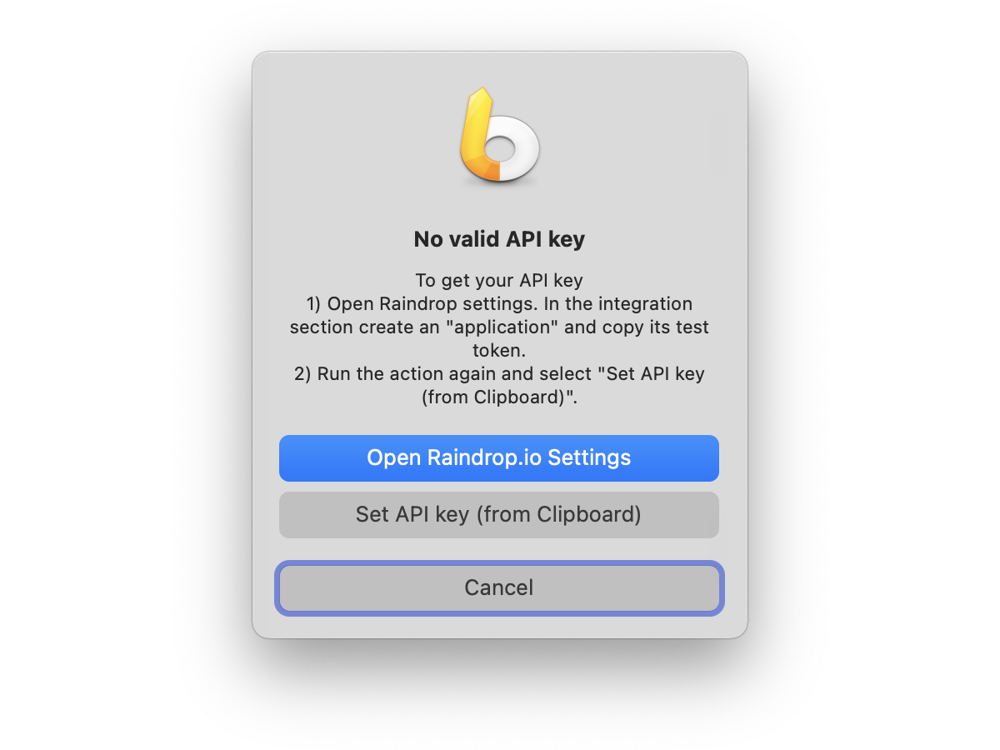
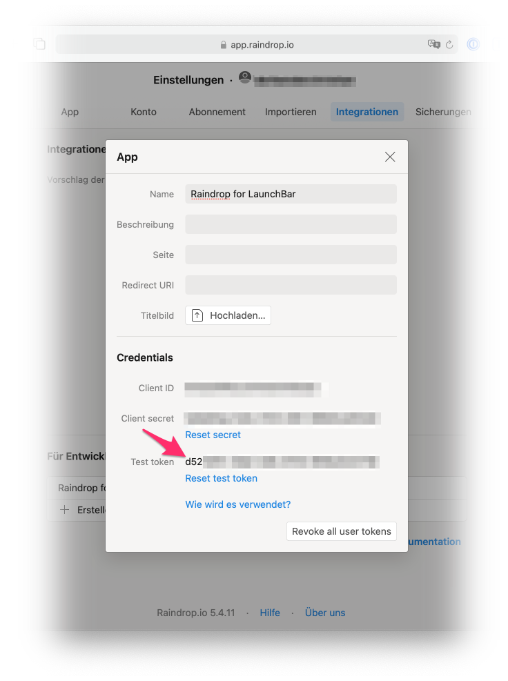

# LaunchBar Action: Raindrops (Raindrop.io)
 
 
 
This actions lets you browse or search your bookmarks from Raindrop.io.

Options:

1. ⏎ = Browse recent items
2. space = Search all items
3. ⌘⏎ = Open the app 

## First run
 

When you run the aciton for the first time you will be notice that you need an API key. 

Step 1: Open Raindrop settings. In the integration section create an "application" and copy its test token. 

Step 2: Run the action again and select "Set API key (from Clipboard)"

 

## Download

[Download LaunchBar Action: Raindrops (Raindrop.io)](https://minhaskamal.github.io/DownGit/#/home?url=https://github.com/Ptujec/LaunchBar/tree/master/Raindrops-Action) (powered by [DownGit](https://github.com/MinhasKamal/DownGit))