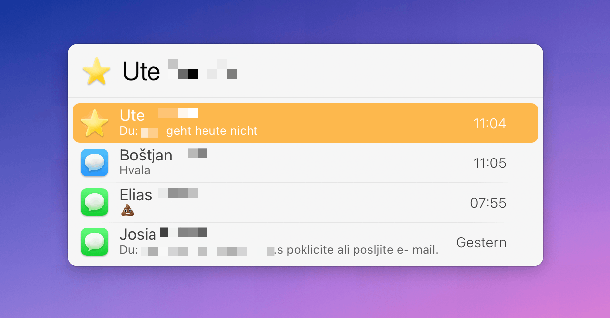

# LaunchBar Action: Recent Messages

This action shows the most recent message of your recent chats. 

The action is associated with the Messages app, so you can simply select the app and press `space` to view your recent messages. 

 

I had some fun with the icons in this one. SMS has green, iMessage blue icons. There are also unread indicators. A star indicates a pinned chat. Pinned chats appear on top. All other chats are sorted by the most recent message date. 

Type to narrow down results.

## Installation & Requirements (IMPORTANT!)

Unfortunately, in order to run smoothly, actions written in Swift need to be both "unquarantined" and compiled. I made [a dedicated action that does both](https://github.com/Ptujec/LaunchBar/tree/master/Compile-Swift-Action#readme). Run the `.lbaction` bundle of this action through the compile action before you start using it.

This action also requires **contact access**. You will be prompted for it. You can also get to the respective privacy settings when you hit `enter` on the alert message in the LaunchBar interface.

Let me know if you need help. 

## Download & Update

[Click here](https://github.com/Ptujec/LaunchBar/archive/refs/heads/master.zip) to download this LaunchBar action along with all the others. Or simply use [LaunchBar Repo Updates](https://github.com/Ptujec/LaunchBar/tree/master/LB-Repo-Updates#launchbar-repo-updates-action)! It helps automate updating existing and installing new actions.

## Known Limitations

While this action is simple on the surface, it is not so simple underneath. So there might be some rough edges.

### Potential Database Issues

There is no official API to access recent messages. So this action is reading `~/Library/Messages/chat.db`, an SQL database. 

This database file might be corrupted, empty, or not properly updated by Apple. 

Don't blame me if something goes wrong. And I can't promise that it will work. However, for me, it helped to log out of iCloud, close the app, delete all content in `~/Library/Messages/`, restart, and then log in again. 

### Opening Group Chats & Service Messages

Support for group chats is limited. All chats will show up. However, the URL scheme (`imessage://open?addresses=`) does not work properly with named group chats. Instead of opening the existing chat, it will start a new chat with the participants. This is why, in that case, the generic `messages://` URL is used, which just opens Messages.

Service messages don't have a proper identifier. So, in these cases, the action also uses the generic URL.

### Message Display Weirdness

Parsing the `attributedBody` is [quite an adventure](https://chrissardegna.com/blog/reverse-engineering-apples-typedstream-format/) as it is stored in a [legacy format](https://developer.apple.com/documentation/foundation/nsarchiver). So displaying the message text might not always work as one would wish.

### LaunchBar Limitations

There are also limitations due to how LaunchBar actions work. Items don't automatically update until you run the action again. So e.g. a message might show an unread badge for a message that has already been read. 

The performance may vary a little. Getting names takes a while. We try to compensate that with caching. But on the initial run the action might take a second.

If you want to renew cached names hold `command` when running the action.  

Cached data is stored in the actions support path (`~/Library/Application Support/LaunchBar/Action Support/ptujec.LaunchBar.action.RecentMessages`).

