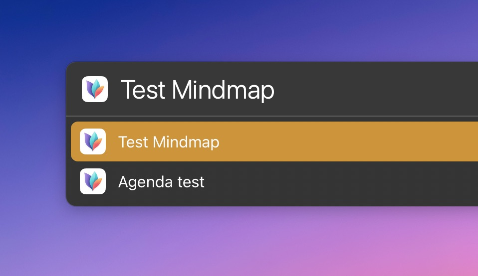

# LaunchBar Actions: Recent MindNode Next Documents

Do you miss seeing recent files when you select [MindNode Next](https://mindnode.com/next) in LaunchBar and press `space`? 

 

This action should at least come close to [what you are used to from apps like Pages, Keynote, etc.](https://youtu.be/lLZgKIthbOk?t=82). If you select MindNode Next and press `space`, it will show your recent documents. 

With another `space` you can even use quicklook to preview the selected document. 

## Limitations 

As MindNode Next documents are not stored as files but in a database, there are some things you cannot do, e.g. renaming a selected document or revealing it in the Finder.

## Download

[Click here](https://github.com/Ptujec/LaunchBar/archive/refs/heads/master.zip) to download this LaunchBar action along with all the others. Or [clone](https://docs.github.com/en/repositories/creating-and-managing-repositories/cloning-a-repository) this repository.

## Updates

Use [Local Action Updates](https://github.com/Ptujec/LaunchBar/tree/master/Local-Action-Updates#launchbar-action-local-action-updates) to keep track of new versions of all my actions and discover new ones at the same time. 

This action also supports [Action Updates](https://github.com/prenagha/launchbar) by Padraic Renaghan.