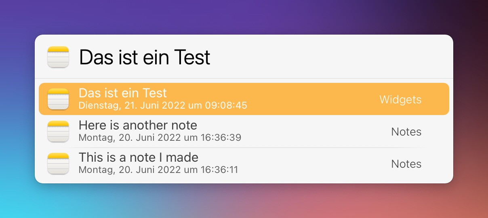

# LaunchBar Action: Recent Notes

A simple action to show recent Apple Notes and open them in the app.

The action is associated with Notes.app, so you can simply select Notes.app and press `space` to show your notes. Narrow down the results by typing as usual.

**Note:** If you are looking for more features, you can try [Roey's Action](https://github.com/roeybiran/launchbar-actions/tree/main/notes-search.lbaction/Contents/Scripts).

## Download & Update

[Click here](https://github.com/Ptujec/LaunchBar/archive/refs/heads/master.zip) to download this LaunchBar action along with all the others. Or simply use [LaunchBar Repo Updates](https://github.com/Ptujec/LaunchBar/tree/master/LB-Repo-Updates#launchbar-repo-updates-action)! It helps automate updating existing and installing new actions.