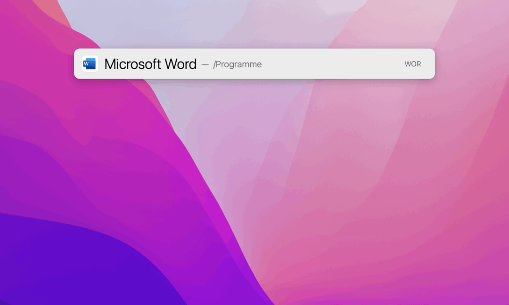

# LaunchBar Actions: Recent Office Documents

**Update 2022-01-24: After tweeting about my actions today I found out that @nriley already built actions for the very same purpose, but without the limitations mentioned below. [So feel free to use his instead](https://github.com/nriley/LBOfficeMRU/releases).** 

Do you miss recent files when you select Word, Powerpoint or Excel in LaunchBar and press space? 

 

These actions should at least come close to [what you are used from apps like Pages, Keynote, etc.](https://youtu.be/lLZgKIthbOk?t=82). The actions are associated with the corresponding office apps, so now Word, Powerpoint and Excel will show documents you recently worked on when you press space.  

## Limitations 

Documents will not show up in this list if you just open them without making changes. Unfortunately Microsoft only updates the date in its apps plist when a document gets changed. 

## Download

[Download LaunchBar Actions: Recent Office Documents](https://minhaskamal.github.io/DownGit/#/home?url=https://github.com/Ptujec/LaunchBar/tree/master/Recent-Office-Documents) (powered by [DownGit](https://github.com/MinhasKamal/DownGit))

## Updates

This action integrates with Action Updates by @prenagha. You can find the [latest version in his Github repository](https://github.com/prenagha/launchbar). For more information and a signed version of Action Updates [visit his website](https://renaghan.com/launchbar/action-updates/).