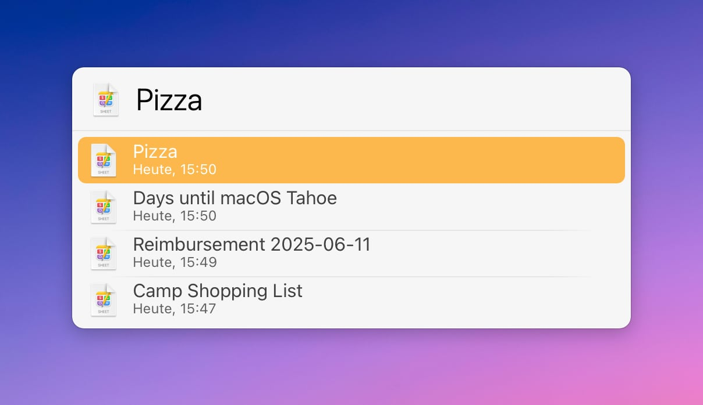

# LaunchBar Action: Recent Soulver Sheets

This action displays [Soulver](https://soulver.app/features/) sheets sorted by their modification date.

You can preview the sheet's contents by pressing <kbd>Space</kbd> or <kbd>Command</kbd> + <kbd>Y</kbd>.

**Note:** New sheets appear when Soulver saves to `Default.sheetbook`. This usually happens when another application is in focus.

## Download & Update

[Click here](https://github.com/Ptujec/LaunchBar/archive/refs/heads/master.zip) to download this LaunchBar action along with all the others. Or simply use [LaunchBar Repo Updates](https://github.com/Ptujec/LaunchBar/tree/master/LB-Repo-Updates#launchbar-repo-updates-action)! It helps automate updating existing and installing new actions.