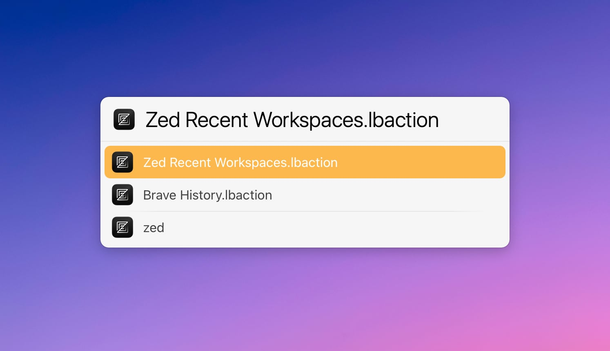

# LaunchBar Action: Recent Zed Workspaces

*[→ See a list of all my actions here.](https://ptujec.github.io/launchbar)* 

This is a simple action that displays your recently used workspaces in [Zed](https://zed.dev). Hold `command` to reveal the local path (will open the first if more than one).  

## Download & Update

[Click here](https://github.com/Ptujec/LaunchBar/archive/refs/heads/master.zip) to download this LaunchBar action along with all the others. Or simply use [LaunchBar Repo Updates](https://github.com/Ptujec/LaunchBar/tree/master/LB-Repo-Updates#launchbar-repo-updates-action)! It helps automate updating existing and installing new actions.
