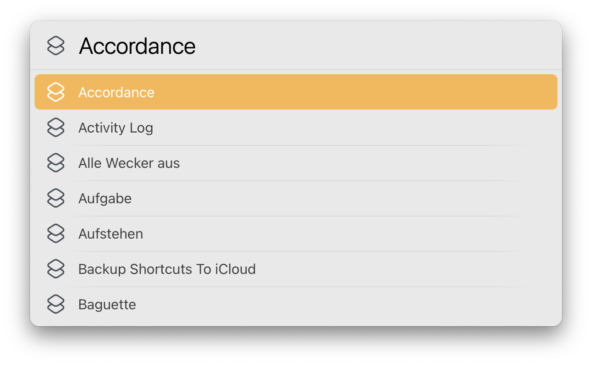
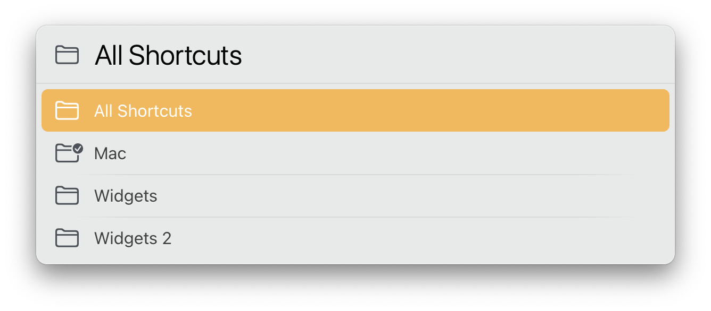
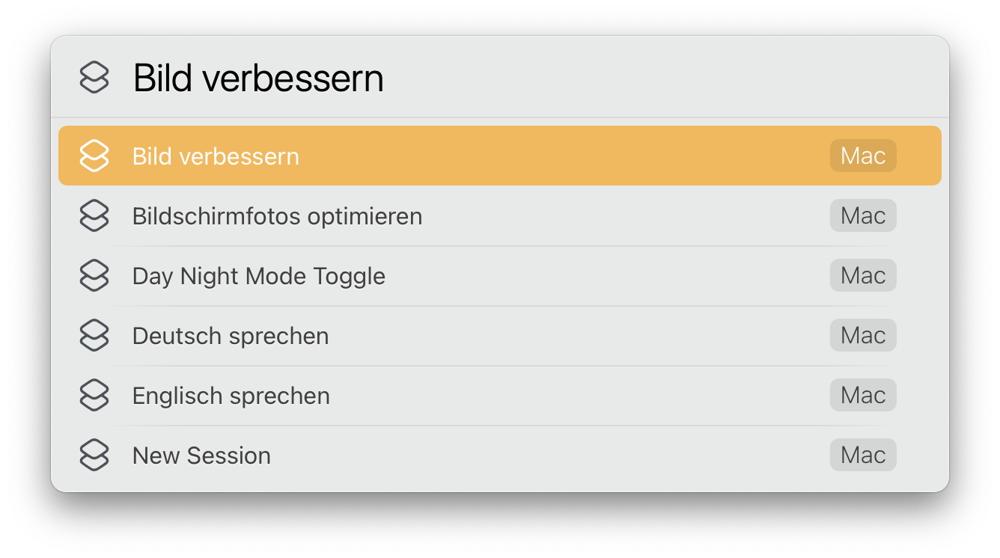

# LaunchBar Action: Run Shortcut

 

This action lists all your shortcuts (macOS 12 required). Select one (with arrow keys or by typing) and hit return to run it.

 

You can limit the list of shortcuts to a specific folder, which you can select by pressing `⇧⏎`.

 

(This action is associated with the Shortcuts app. This means you also get the list, if you hit right arrow or space, when the app is selected in LaunchBar.)
 

## Download & Update

[Click here](https://github.com/Ptujec/LaunchBar/archive/refs/heads/master.zip) to download this LaunchBar action along with all the others. Or simply use [LaunchBar Repo Updates](https://github.com/Ptujec/LaunchBar/tree/master/LB-Repo-Updates#launchbar-repo-updates-action)! It helps automate updating existing and installing new actions. 