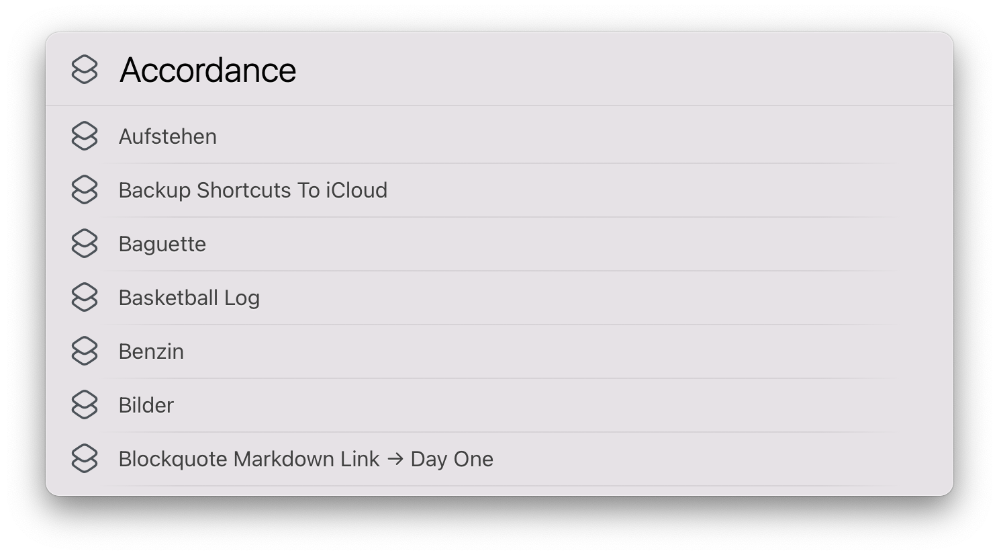

# LaunchBar Action: Run Shortcut

 

This action lists all your shortcuts (macOS 12 required). Select one (with arrow keys or by typing) and hit return to run it.
This action is associated with the Shortcuts app. This means you also get the list if you hit right arrow or space when the app is selected in LaunchBar.  

## Download

[Download LaunchBar Action: Run Shortcut](https://minhaskamal.github.io/DownGit/#/home?url=https://github.com/Ptujec/LaunchBar/tree/master/Run-Shortcut) (powered by [DownGit](https://github.com/MinhasKamal/DownGit)) 