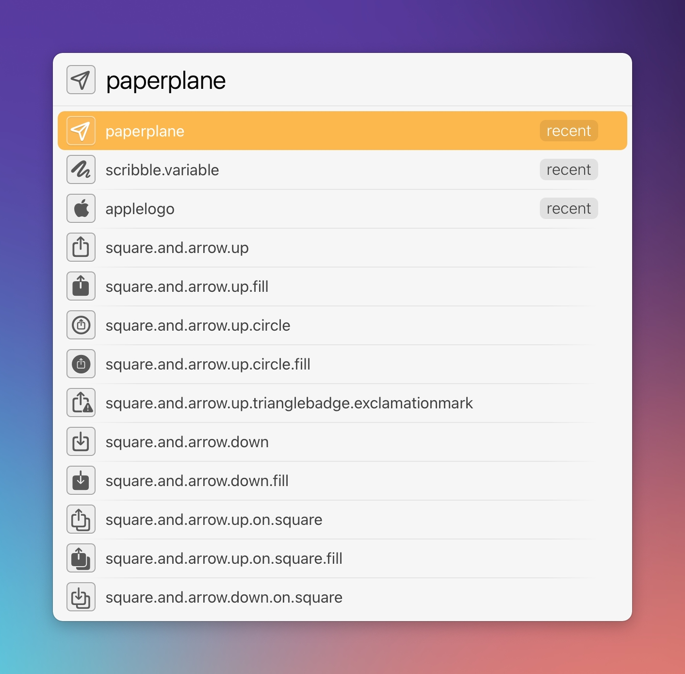

# LaunchBar Action: SF-Symbols Browser 

If you know what SF-Symbols are you probably have the [app installed](https://developer.apple.com/sf-symbols/) along with the [fonts](https://developer.apple.com/fonts/).

This action enables you to browse through them without opening the app. If you have the app installed you can simply select it and press space  `␣`.

 

You can then either paste the symbol `↩` or the name `⌥↩`. 

## Download

[Click here](https://github.com/Ptujec/LaunchBar/archive/refs/heads/master.zip) to download this LaunchBar action along with all the others. Or [clone](https://docs.github.com/en/repositories/creating-and-managing-repositories/cloning-a-repository) this repository.

## Updates

Use [Local Action Updates](https://github.com/Ptujec/LaunchBar/tree/master/Local-Action-Updates#launchbar-action-local-action-updates) to keep track of new versions of all my actions and discover new ones at the same time. 

This action also supports [Action Updates](https://github.com/prenagha/launchbar) by Padraic Renaghan.