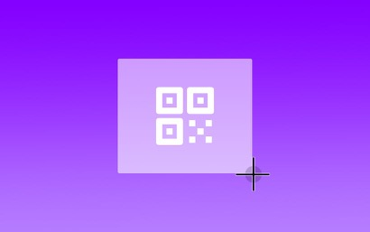

# LaunchBar Action: Scan QR Code

*[→ See a list of all my actions here.](https://ptujec.github.io/launchbar)* 

This is a simple action that lets you scan QR codes. The action will send a notification that, depending on the QR code content, is clickable.

Launching the action will bring up [the standard screenshot UI](https://support.apple.com/en-us/102646#portion). 

 

To select the area of the screen with the QR code, click and hold your mouse or trackpad button while dragging the crosshair.

 

Instead of selecting an area, you can also select the entire window that contains the QR code by pressing the Space bar. The pointer changes to a camera icon. Now click the window to scan the code.

 

If there is just one QR code visible on your screen, you can hold `command` while launching the action to capture the entire screen for scanning the QR code.

## Setup (IMPORTANT!)

**In order to run smoothly, actions written in Swift need to be both "un-quarantined" and compiled. I made [a dedicated action that does both](https://github.com/Ptujec/LaunchBar/tree/master/Compile-Swift-Action#readme). Run the `.lbaction` bundle of this action through the compile action before you start using it.**

## Download & Update

[Click here](https://github.com/Ptujec/LaunchBar/archive/refs/heads/master.zip) to download this LaunchBar action along with all the others. Or simply use [LaunchBar Repo Updates](https://github.com/Ptujec/LaunchBar/tree/master/LB-Repo-Updates#launchbar-repo-updates-action)! It helps automate updating existing and installing new actions.