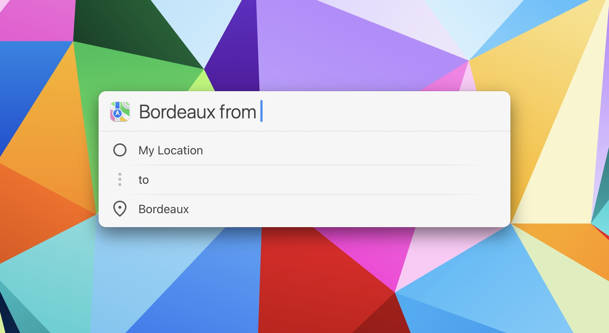
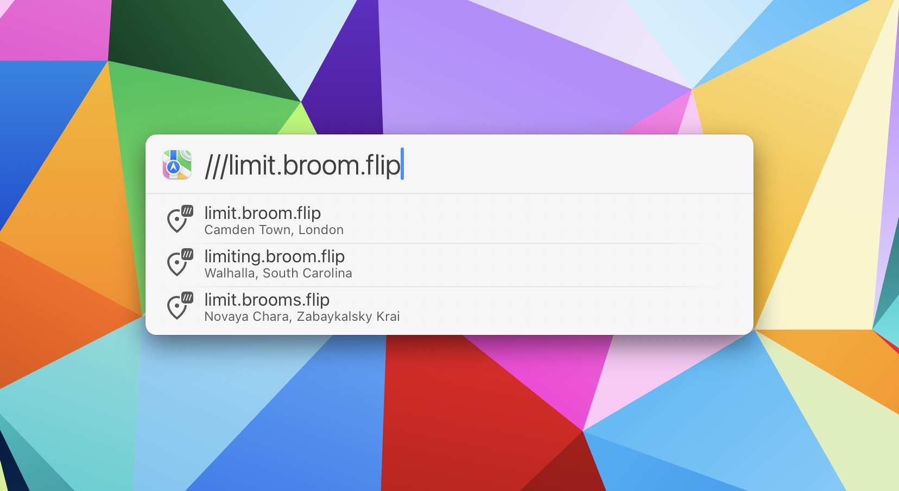

# Search Maps Action for LaunchBar

*[→ See a list of all my actions here.](https://ptujec.github.io/launchbar)* 

This action improves searching on Apple Maps with LaunchBar. The two main features of this action are suggestions as you type and support for directions.

## Suggestions

The action displays suggestions as you type. Because, you know, sometimes it's just hard to recall the correct spelling of certain names. 

 

## Directions

If you indicate you are searching for directions (by using "to" or "from"), the action will display how it is interpreting your search query.

 

If you want to utilize the suggestion feature for your destination, you may start your query with the destination followed by the word "from". Doing so will result in the action defaulting to the current location if you do not specify a source location. 

 

## what3words

The action also supports [what3words](https://what3words.com/about) locations. An API key is required. Recognition is pretty flexible. You can skip the 3 slashes or send the entire url. It doesn't matter.  

 

## Performance

The suggestion script of this action is written in Swift. Swift scripts perform better when compiled. [Therefore, if you want to show suggestions more quickly, you can compile the script using the Compile Swift Action](https://github.com/Ptujec/LaunchBar/tree/master/Compile-Swift-Action#launchbar-action-compile-swift-action).

## Download

[Download Search Maps Action](https://minhaskamal.github.io/DownGit/#/home?url=https://github.com/Ptujec/LaunchBar/tree/master/Search-Maps) (powered by [DownGit](https://github.com/MinhasKamal/DownGit))
