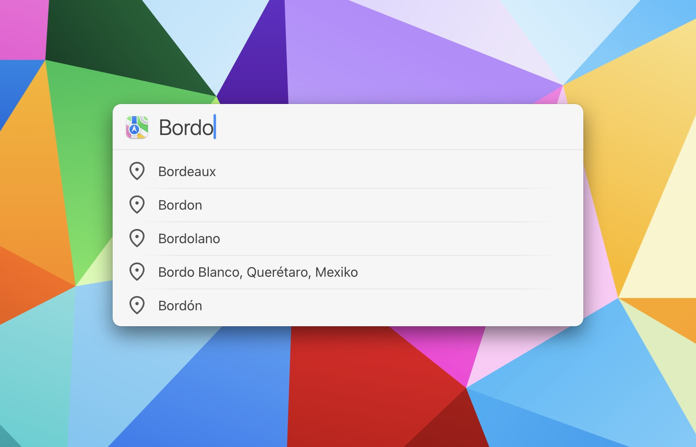

# Search Maps Action for LaunchBar

*[→ See a list of all my actions here.](https://ptujec.github.io/launchbar)* 

## Suggestions

This action adds suggestions, when you search in Apple Maps with LaunchBar. Because, you know, sometimes it is just hard to recall the correct spelling of certain names. 

 

## Directions

If you indicate you are searching for directions (by using "to" or "from"), the action will display how it is interpreting your search query.

 

Starting with the destination is another option, especially if you want to take advantage of the suggestion feature. 

## Setup

The suggestion script of this action is written in Swift. Swift scripts offer better performance when compiled. [To compile the script, use the Compile Swift Action](https://github.com/Ptujec/LaunchBar/tree/master/Compile-Swift-Action#launchbar-action-compile-swift-action).

## Download

[Download Search Maps Action](https://minhaskamal.github.io/DownGit/#/home?url=https://github.com/Ptujec/LaunchBar/tree/master/Search-Actions) (powered by [DownGit](https://github.com/MinhasKamal/DownGit))
