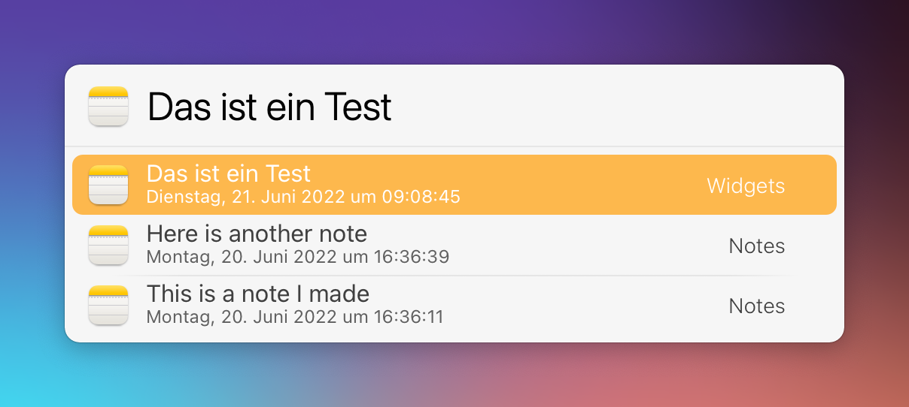

# LaunchBar Action: Search Notes

A simple action to search Apple Notes and open them in the app. 

 

The action is associated with the Notes app. So you can simply select Notes and press `space` to search.  

Note: AppleScript is  a little slow for my taste. But I have not found a better solution. Shortcuts was about the same in my testing. 

## Download

[Download LaunchBar Action: Search Notes](https://minhaskamal.github.io/DownGit/#/home?url=https://github.com/Ptujec/LaunchBar/tree/master/Search-Notes) (powered by [DownGit](https://github.com/MinhasKamal/DownGit))

## Updates

This action integrates with Action Updates by @prenagha. You can find the [latest version in his Github repository](https://github.com/prenagha/launchbar). For more information and a signed version of Action Updates [visit his website](https://renaghan.com/launchbar/action-updates/).