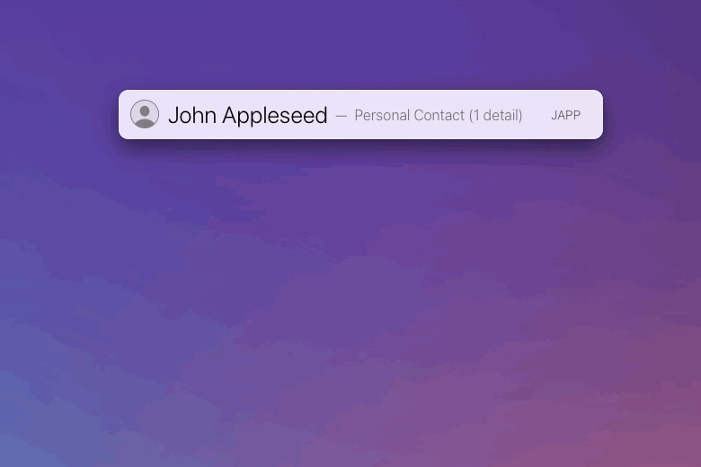

# LaunchBar Action: Send iMessage to Contact

You can tell LaunchBar to open Messages for a phone number out of the box. This action is an alternative way to do it. With this action all you need to do is select a contact and send it to the action. The number is picked automatically. 

Or you can select the action and type the contacts name.  

## Installation & Requirements (IMPORTANT!)

Unfortunately, in order to run smoothly, actions written in Swift need to be both "unquarantined" and compiled. I made [a dedicated action that does both](https://github.com/Ptujec/LaunchBar/tree/master/Compile-Swift-Action#readme). Run the `.lbaction` bundle of this action through the compile action before you start using it.

This action also requires **contact access**. You will be prompted for it. You can also get to the respective privacy settings when you hit <kbd>enter</kbd> on the alert message in the LaunchBar interface.

Let me know if you need help. 

## Download & Update

[Click here](https://github.com/Ptujec/LaunchBar/archive/refs/heads/master.zip) to download this LaunchBar action along with all the others. Or simply use [LaunchBar Repo Updates](https://github.com/Ptujec/LaunchBar/tree/master/LB-Repo-Updates#launchbar-repo-updates-action)! It helps automate updating existing and installing new actions.