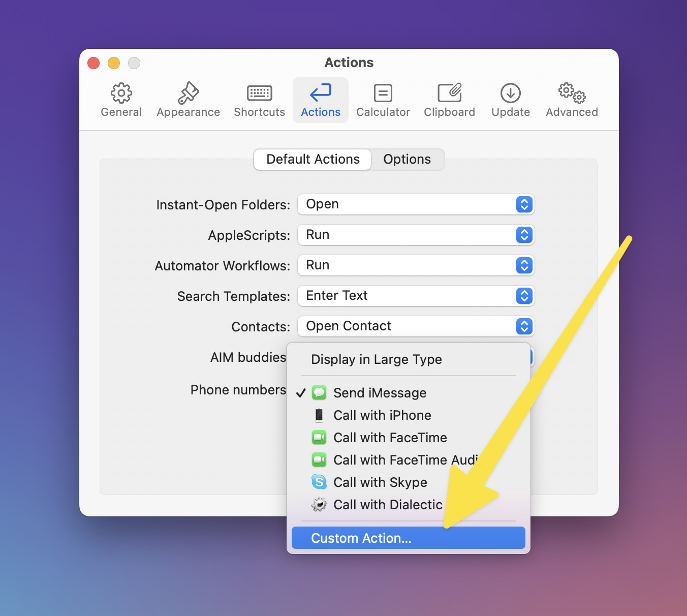

# LaunchBar Action: Send iMessage

This action is meant as a fix for the feature to send an iMessage for a selected number, that is currently broken. Install and select this as the "custom action" here:

## Download
[Click here](https://github.com/Ptujec/LaunchBar/archive/refs/heads/master.zip) to download this LaunchBar Action along with all the others. Or [clone](https://docs.github.com/en/repositories/creating-and-managing-repositories/cloning-a-repository) this repository.