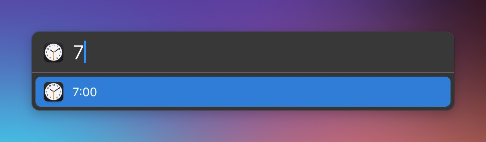

# LaunchBar Action: Set alarm

 

This action makes use of the new built-in clock app. It let's you set alarms in no time. It relies on a shortcut so it needs a tiny bit of set up.

You can also add a description. (Just follow the pattern of time-space-description e.g. "16 Tea")

## Set up

1) Install the shortcut named ["Set alarm"](https://www.icloud.com/shortcuts/fdb0869ec1f04bab9390ba988d6e2eab)

2) Download and install the action as usual below. 

## Download

[Download LaunchBar Action: Set alarm](https://minhaskamal.github.io/DownGit/#/home?url=https://github.com/Ptujec/LaunchBar/tree/master/Set-alarm) (powered by [DownGit](https://github.com/MinhasKamal/DownGit))

## Updates

This action integrates with Action Updates by @prenagha. You can find the [latest version in his Github repository](https://github.com/prenagha/launchbar). For more information and a signed version of Action Updates [visit his website](https://renaghan.com/launchbar/action-updates/).