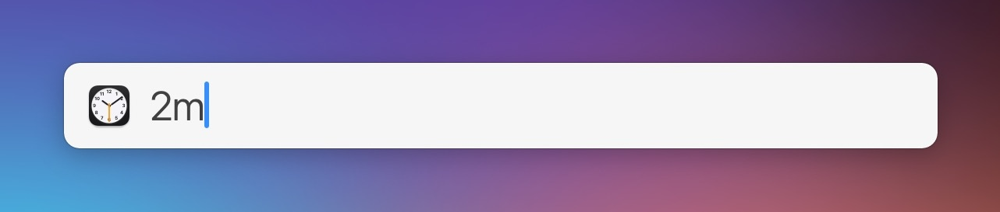

# LaunchBar Action: Set timer

 

This action makes use of the new built-in clock app. It let's you set timers. (This probably could be written entirely in shortcuts. But it is more fun this way. At least for me.)

Examples: 
- "1m" or just "1" = 1 minute
- "30s" = 30 seconds
- "1h" = 1 hour

It relies on a shortcut so it needs a tiny bit of set up.

## Set up

1) Install the shortcut named ["Set timer"](https://www.icloud.com/shortcuts/6769921fa76d437faa22bec595020ede)

2) Download and install the action as usual below. 

## Download & Update

[Click here](https://github.com/Ptujec/LaunchBar/archive/refs/heads/master.zip) to download this LaunchBar action along with all the others. Or simply use [LaunchBar Repo Updates](https://github.com/Ptujec/LaunchBar/tree/master/LB-Repo-Updates#launchbar-repo-updates-action)! It helps automate updating existing and installing new actions.