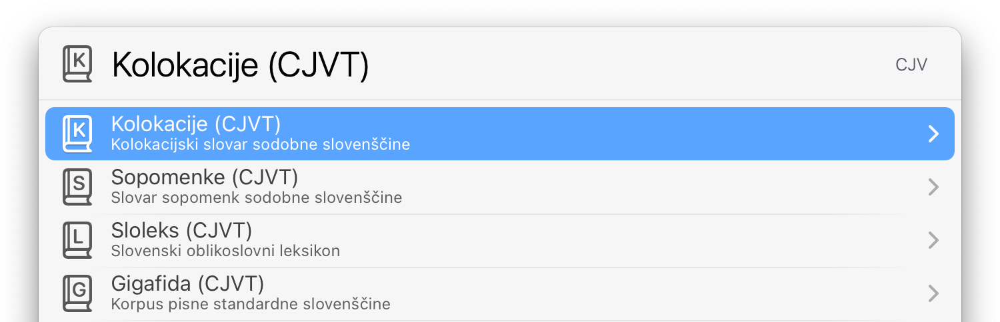
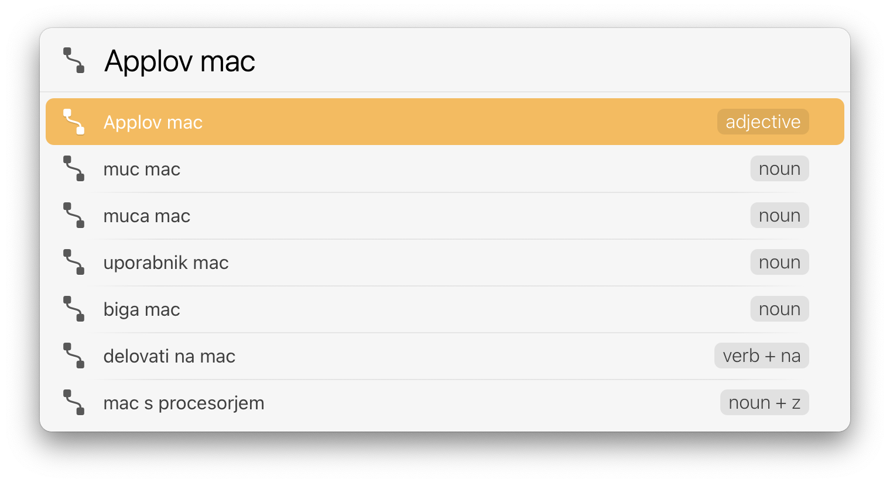
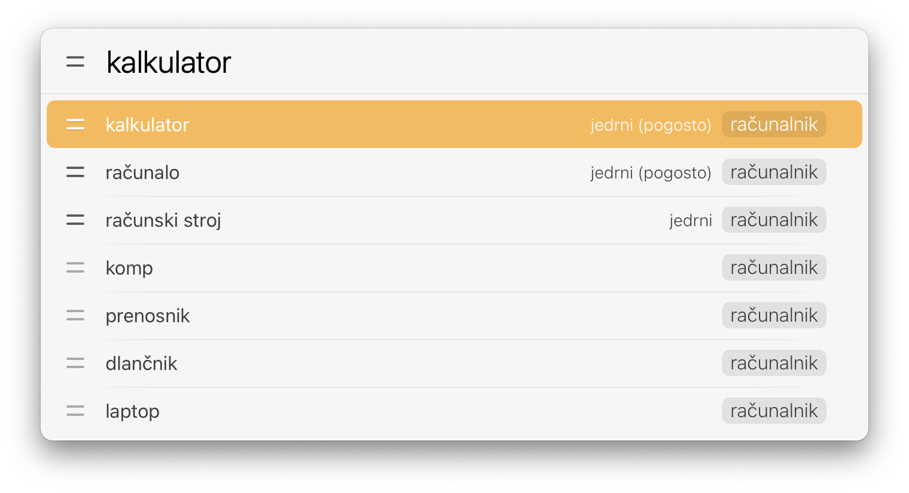
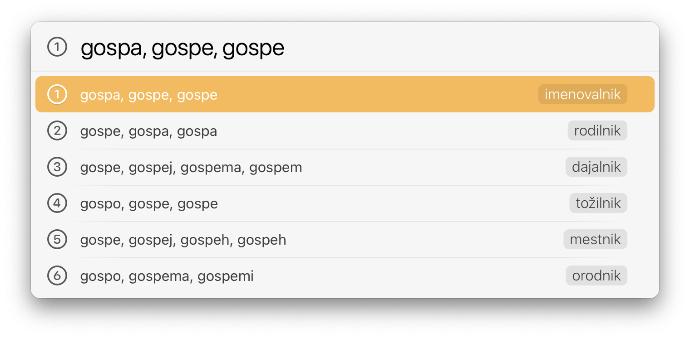
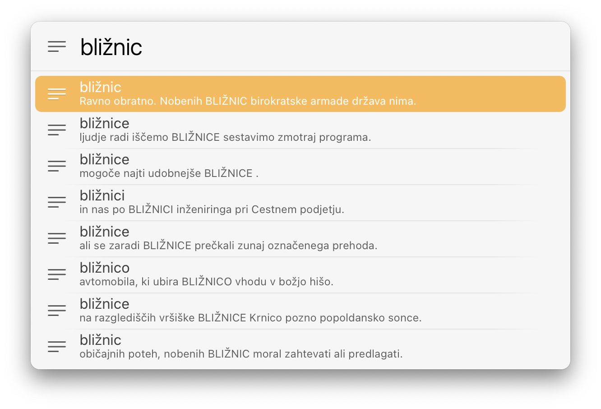
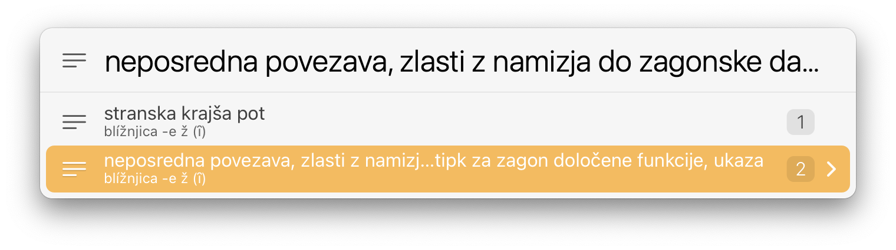
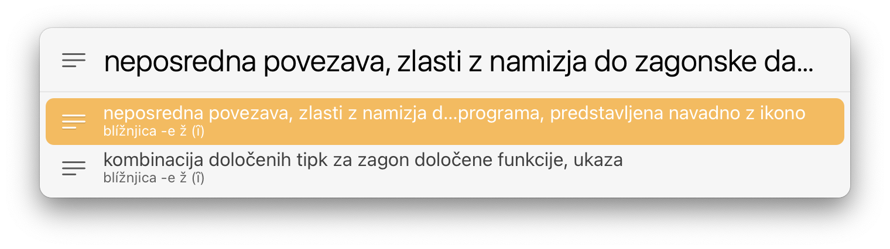
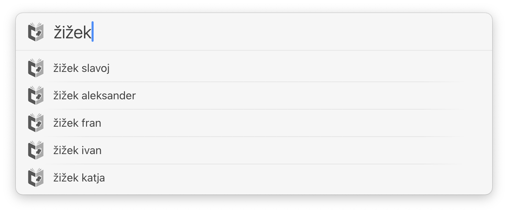
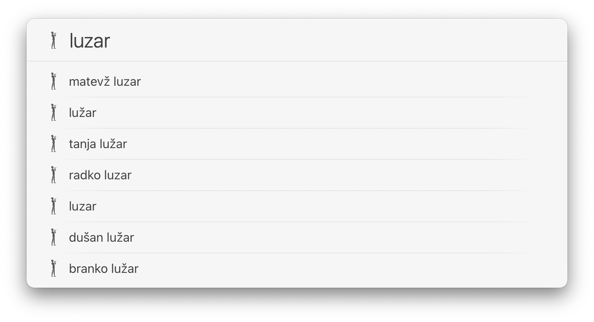

# Slovene Actions for LaunchBar

## Slovene Language Tools by CJVT

The following actions are a LaunchBar interface to tools from CJVT (Center za jezikovne vire in tehnologije Univerze v Ljubljani). 

[Kolokacije, kolokacijski slovar sodobne slovenščine](https://viri.cjvt.si/kolokacije/slv/about)

[Sopomenke, slovar sopomenk sodobne slovenščine](https://viri.cjvt.si/sopomenke/slv/about) 

[Sloleks, slovenski oblikoslovni leksikon](https://viri.cjvt.si/sloleks/slv/about)

[Gigafida, korpus pisne standardne slovenščine](https://viri.cjvt.si/gigafida/System/About) 

CJVT tools are provided under a Creative Commons Attribution-NonCommercial-ShareAlike 4.0 International license [(CC BY-NC-SA 4.0)](https://creativecommons.org/licenses/by-nc-sa/4.0/). 

## Slovar slovenskega knjižnega jezika (SSKJ²)

SSKJ data is from [fran.si](https://www.fran.si/133/sskj2-slovar-slovenskega-knjiznega-jezika-2)

## Cobiss search with suggestions

## RTV Slo 4D

## Download

[Download Slovene Actions for LaunchBar](https://minhaskamal.github.io/DownGit/#/home?url=https://github.com/Ptujec/LaunchBar/tree/master/Slovene-Actions) (powered by [DownGit](https://github.com/MinhasKamal/DownGit))

## Updates

These actions integrate with Action Updates by @prenagha. You can find the [latest version of Action Updates in his Github repository](https://github.com/prenagha/launchbar). For more information and a signed version of Action Updates [visit his website](https://renaghan.com/launchbar/action-updates/).
