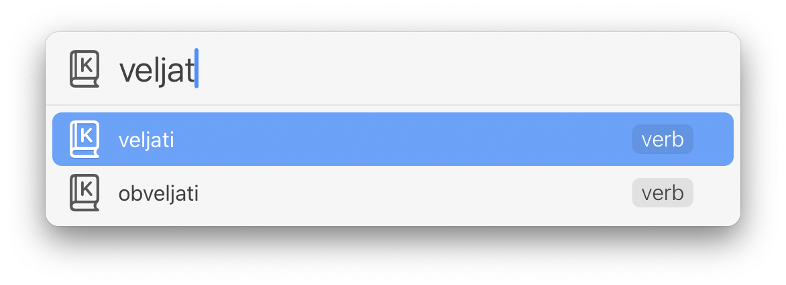
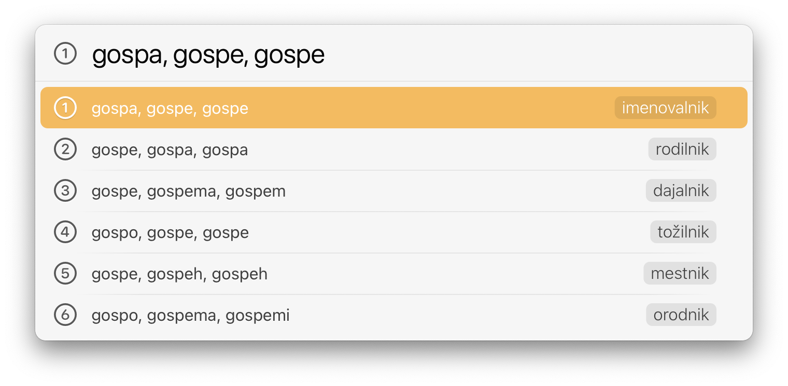
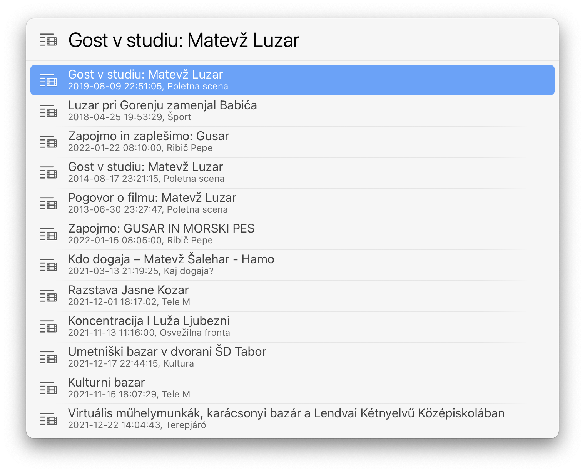

# Slovene Actions for LaunchBar

## Slovene Language Tools by CJVT

The following actions are a LaunchBar interface to tools from CJVT (Center za jezikovne vire in tehnologije Univerze v Ljubljani). 

[Kolokacije, kolokacijski slovar sodobne slovenščine](https://viri.cjvt.si/kolokacije/slv/about)

[Sopomenke, slovar sopomenk sodobne slovenščine](https://viri.cjvt.si/sopomenke/slv/about) 

[Sloleks, slovenski oblikoslovni leksikon](https://viri.cjvt.si/sloleks/slv/about)

[Gigafida, korpus pisne standardne slovenščine](https://viri.cjvt.si/gigafida/System/About) 

Note: This action includes a swift script which you can [compile with this action](https://github.com/Ptujec/LaunchBar/tree/master/Compile-Swift-Action). In this case you also need to uncomment line 68 and comment out line 66 in `default.js`. Please ask if you need help with that.

CJVT tools are provided under a Creative Commons Attribution-NonCommercial-ShareAlike 4.0 International license [(CC BY-NC-SA 4.0)](https://creativecommons.org/licenses/by-nc-sa/4.0/). 

## Slovar slovenskega knjižnega jezika (SSKJ²)

SSKJ data is from [fran.si](https://www.fran.si/133/sskj2-slovar-slovenskega-knjiznega-jezika-2)

## Cobiss search with suggestions

## RTV 365

## RTV Slo 4D

## Download

[Click here](https://github.com/Ptujec/LaunchBar/archive/refs/heads/master.zip) to download this LaunchBar action along with all the others. Or [clone](https://docs.github.com/en/repositories/creating-and-managing-repositories/cloning-a-repository) this repository.

## Updates

Use [Local Action Updates](https://github.com/Ptujec/LaunchBar/tree/master/Local-Action-Updates#launchbar-action-local-action-updates) to keep track of new versions of all my actions and discover new ones at the same time. 

This action also supports [Action Updates](https://github.com/prenagha/launchbar) by Padraic Renaghan.