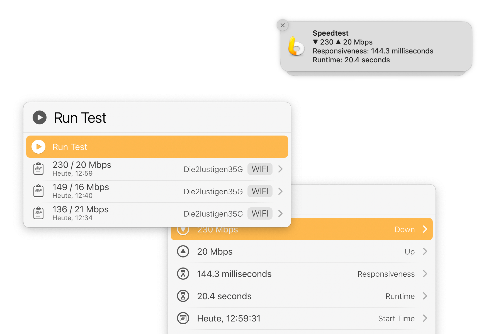

# LaunchBar Action: Speedtest

 

This action runs the `networkQuality` command in the background and sends a notification with the results when done.

Alternatively, you can hold `command` (`⌘`) to run the test in the Terminal app. This way you can follow the progress as the test is running.

The action also displays a **history** of past tests.

These reports are stored in the action’s support path: `~/Library/Application Support/LaunchBar/Action Support/ptujec.LaunchBar.action.Speedtest`.

You can view a report’s details by pressing `→` or `space`, or open the report’s source file by holding `command`.

**Note:** Reports are not saved if you run the test in the Terminal app.

**Note about Wi-Fi name:** If the name is only shown as "\<redacted\>", you can fix this by entering the following line in the Terminal: `sudo ipconfig setverbose 1`. 

## Requirements 

This action requires macOS 12 (Monterey).

## Download & Update

[Click here](https://github.com/Ptujec/LaunchBar/archive/refs/heads/master.zip) to download this LaunchBar action along with all the others. Or simply use [LaunchBar Repo Updates](https://github.com/Ptujec/LaunchBar/tree/master/LB-Repo-Updates#launchbar-repo-updates-action)! It helps automate updating existing and installing new actions.
