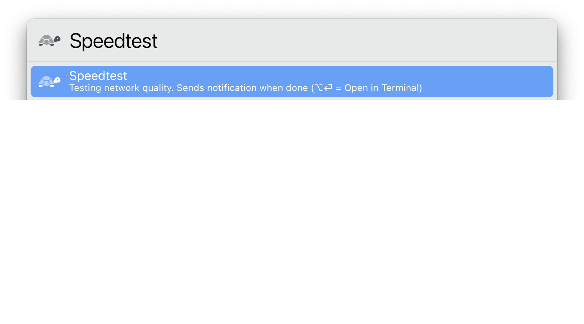
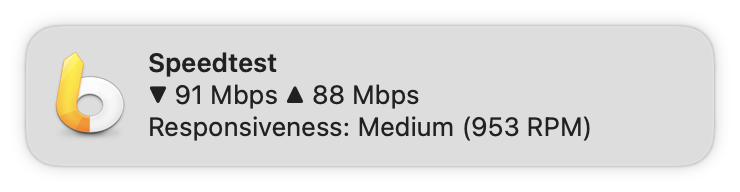
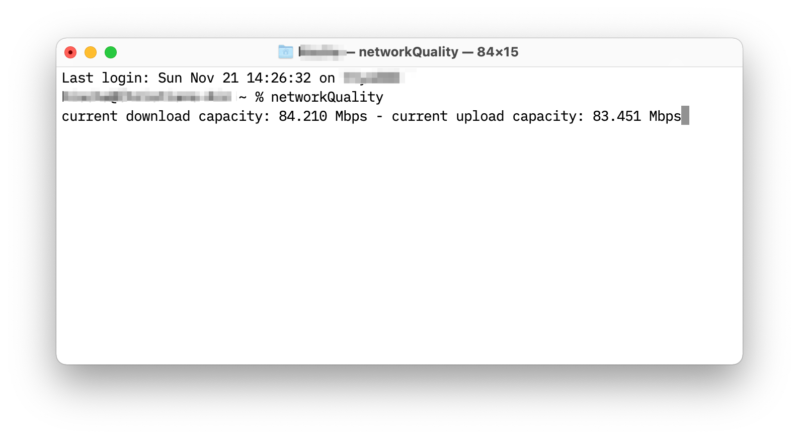

# LaunchBar Action: Speedtest

 

## Requirements 

This action requires macOS 12 (Monterey).

## Features

**1) Show Notification** 

 

It can take a bit for the notification to show up. There will be also a sound so you don't miss it. 

**2) Run in Terminal**

 

Hold option (⌥) while launching the action to run it in the Terminal. This way you will not only see the summary, but also the progress as the action is running.

## Download

[Download LaunchBar Action: Speedtest](https://minhaskamal.github.io/DownGit/#/home?url=https://github.com/Ptujec/LaunchBar/tree/master/Speedtest) (powered by [DownGit](https://github.com/MinhasKamal/DownGit))