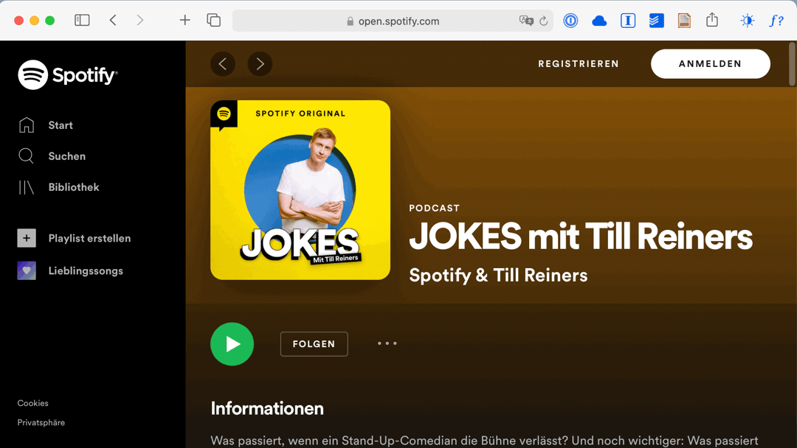

# LaunchBar Action: Spotifeed - Convert Spotify podcasts to RSS feeds.

This is build upon [Tim Dorrs excellent service](https://github.com/timdorr/spotifeed). 

Simply search for the Spotify show you would like to get the RSS feed for on the web. You can send the URL to the action or just run the action to pick up the URL from Safari. 
 
 

Now you have the RSS feed on your clipboard and can use [Apples universal clipboard feature](https://support.apple.com/en-us/HT209460) to paste it in a proper podcast app like e.g. [Castro](https://castro.fm) on your phone. You can also open the RSS feed in [Podcasts](https://www.apple.com/apple-podcasts/) or [Overcast](https://overcast.fm) on your Mac (with ⌘⏎ or a click on the notification).  

## Download

[Download LaunchBar Action: Spotifeed](https://minhaskamal.github.io/DownGit/#/home?url=https://github.com/Ptujec/LaunchBar/tree/master/Spotifeed) (powered by [DownGit](https://github.com/MinhasKamal/DownGit))