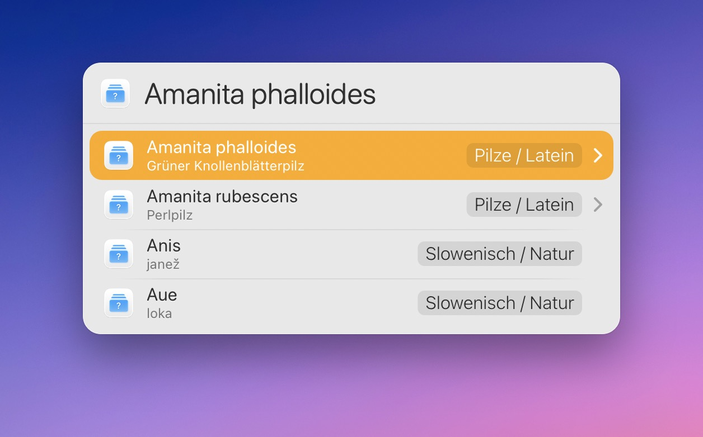

# LaunchBar Action: StudyCards List

*[→ See a list of all my actions here.](https://ptujec.github.io/launchbar)* 

This is a simple action that displays all your cards from the [StudyCards](https://apps.apple.com/app/studycards-karteikarten/id1534325530) app by @[cameronshemilt](https://github.com/cameronshemilt). This allows you to quickly check whether you have already added a card. Both questions and answers are shown.

## Requirements

You need to have StudyCards installed.

## Download & Update

[Click here](https://github.com/Ptujec/LaunchBar/archive/refs/heads/master.zip) to download this LaunchBar action along with all the others. Or simply use [LaunchBar Repo Updates](https://github.com/Ptujec/LaunchBar/tree/master/LB-Repo-Updates#launchbar-repo-updates-action)! It helps automate updating existing and installing new actions.
