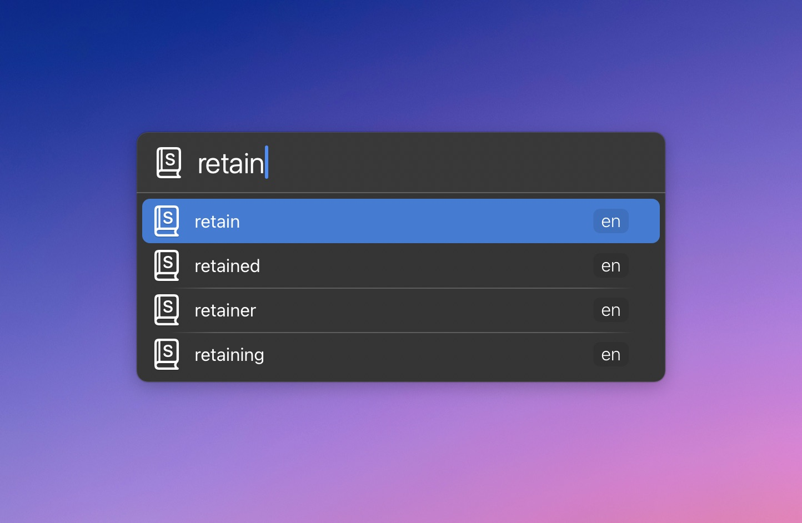
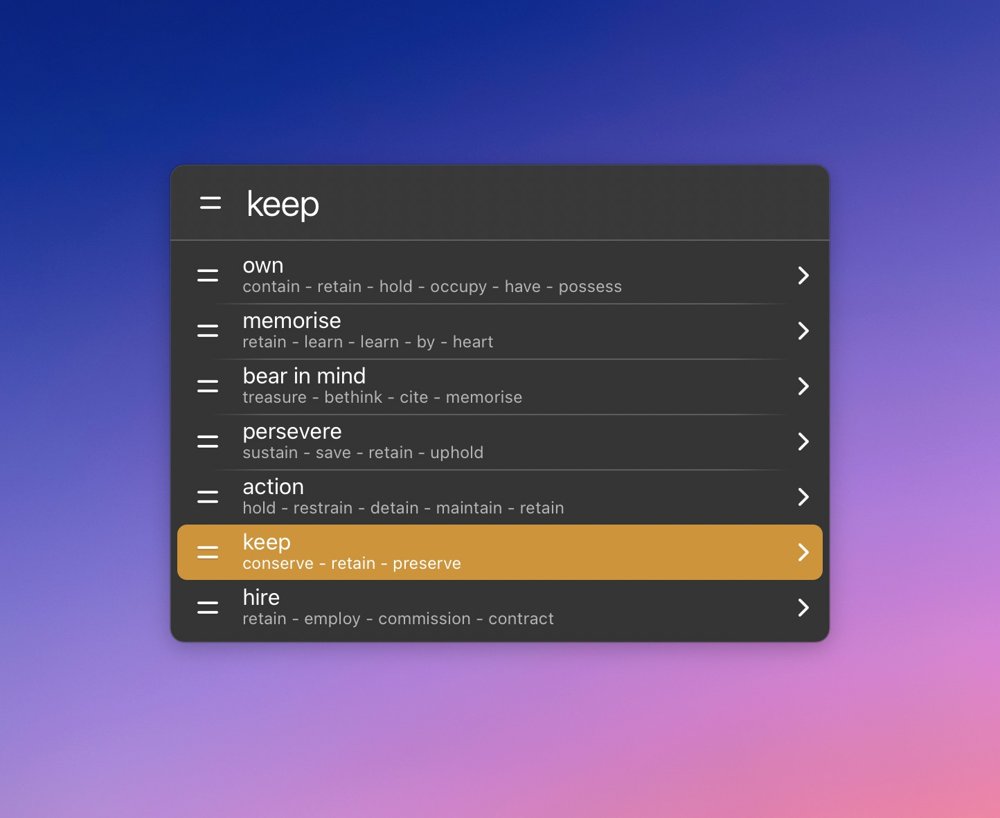

# LaunchBar Action: Synonyms (Woxikon)

This action displays synonyms from https://synonyme.woxikon.de/ in LaunchBar. The action currently supports German and English. 

You can paste results by holding `shift` as usual or open the website with `command`.

**Note:** There is no official API for Woxikon, so this action could break at any time.

## Download & Update

[Click here](https://github.com/Ptujec/LaunchBar/archive/refs/heads/master.zip) to download this LaunchBar action along with all the others. Or simply use [LaunchBar Repo Updates](https://github.com/Ptujec/LaunchBar/tree/master/LB-Repo-Updates#launchbar-repo-updates-action)! It helps automate updating existing and installing new actions.