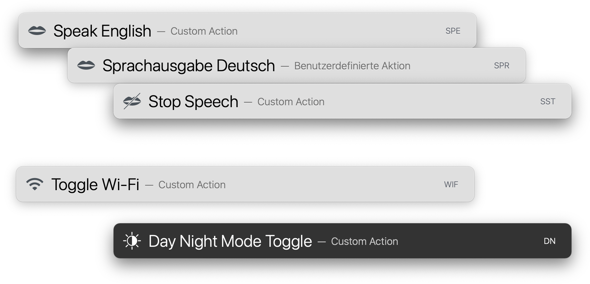

# LaunchBar System Actions
 

## Installation and usage
These actions are created for use with [LaunchBar](http://www.obdev.at/products/launchbar/). Download and double click to install.

## List of actions
- Day Night Toggle
- Uptime
- Wifi Toggle
- Speech actions (German, English, Stop)
