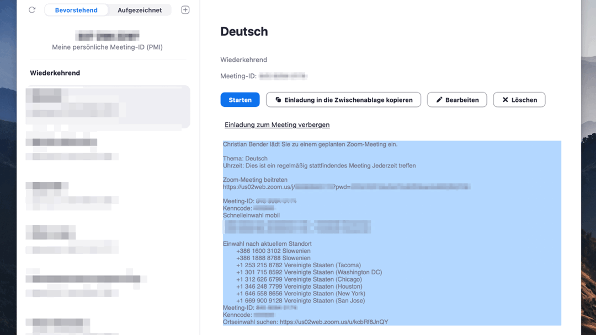

# LaunchBar Text Actions

## Markdown Links to Rich Text Format

 

## Get URLs from text

 

## Full List
- ~~Paste Date~~ [moved to new directory](https://github.com/Ptujec/LaunchBar/tree/master/Paste-Date)
- Get Markdown Link from Safari (and paste into active text field)
- Get RTF Link from Safari (and paste into active text field)
- Get URLs from text
- Lorem Ipsum (Generate placeholder text)
- Lorem Slovensko (Slovene version)
- Markdown Links to Rich Text Format (Convert text with Markdown links into proper Rich Text. If no argument is entered, it will convert the clipboard content.)
- Replace Commas with Linebreaks
- Remove Duplicate Email Addresses

## Download

[Click here](https://github.com/Ptujec/LaunchBar/archive/refs/heads/master.zip) to download this LaunchBar action along with all the others. Or [clone](https://docs.github.com/en/repositories/creating-and-managing-repositories/cloning-a-repository) this repository.

   
