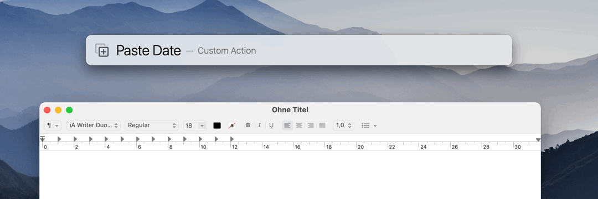

# LaunchBar Text Actions

## Paste Date

 

## Markdown to RTF Link

 

## Get URLs from text

 

## Full List

- Paste Date (Paste current date or date plus/minus some days (e.g. "-3") in an active text field. You can also specify an upcoming day of the week (e.g. "Sunday") or its abbreviation (e.g. "sun")
- Get Markdown Link from Safari (and paste into active text field)
- Get RTF Link from Safari (and paste into active text field)
- Get URLs from text
- Lorem Ipsum (Generate placeholder text)
- Lorem Slovensko (Slovene version)
- Markdown to RTF Link (Convert a Markdown link into a proper RTF link e.g. in Mail)
- Replace Commas with Linebreaks
- Remove Duplicate Email Addresses

## Download

[Download LaunchBar Text Actions](https://minhaskamal.github.io/DownGit/#/home?url=https://github.com/Ptujec/LaunchBar/tree/master/Text-Actions) (powered by [DownGit](https://github.com/MinhasKamal/DownGit))

   
