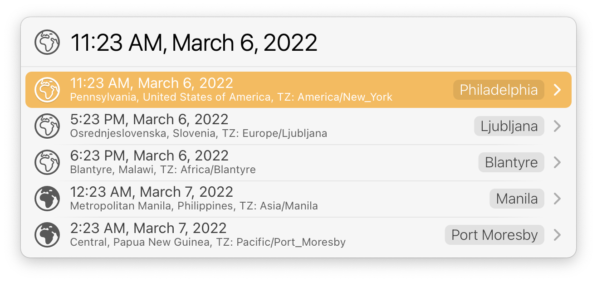
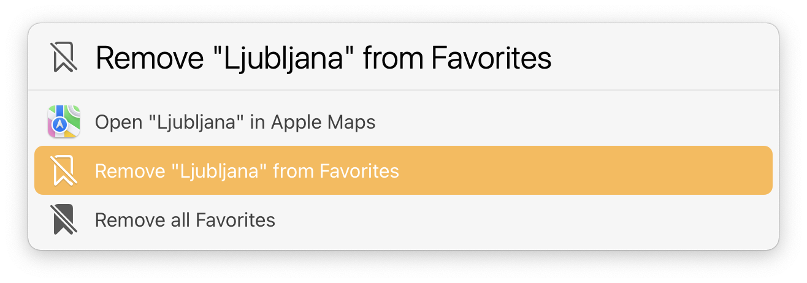

# LaunchBar Action: Time Zones for Cities

This simple action lets you look up the times of a lot of major cities around the world. [The data source is provided by Kevin Roberts](https://github.com/kevinroberts/city-timezones).
The main purpose is to look up cities by pressing "space". 
 
 

But you can also add cities to a list of favorites, …

 

… which you will be presented with, when you just hit return. 

 

You can also remove items from your Favorites, or remove all Favorites, if you want to start over. 

 

## Download

[Click here](https://github.com/Ptujec/LaunchBar/archive/refs/heads/master.zip) to download this LaunchBar action along with all the others. Or [clone](https://docs.github.com/en/repositories/creating-and-managing-repositories/cloning-a-repository) this repository.

## Updates

The latest version of this action integrates with Action Updates by @prenagha.    You can find the [latest version in his Github repository](https://github.com/prenagha/launchbar). For more information and a signed version of Action Updates [visit his website](https://renaghan.com/launchbar/action-updates/).