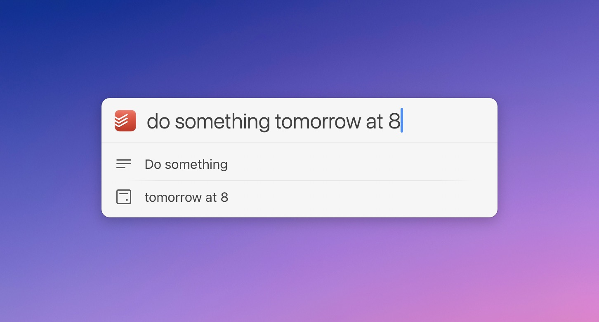

# LaunchBar Action: Todoist Inbox

## Why? 

Todoist has its own [quick add function](https://todoist.com/help/articles/task-quick-add). And it’s really really good! So what’s the benefit of a LaunchBar action?

If you don't mind using global shortcuts, there really is not much of a good reason. Even if you do mind, you could do, what I did for a long time. For a long time, I would use a custom action to either simulate pressing the global shortcut or lately launching it with the URI scheme "todoist://addtask". 

The were only a few minor things bugging me with when using my old action: 

1) Running the action, when Todoist is not running. My old action does not work in that (rare) case. Neither does the global shortcut. The app needs to run first. The new action does not need the app running, because it is using the API directly. 

2) When working in fullscreen mode the old action would result in switching to the desktop or the interface would show up on my other screen. 

3) My old action would also frequently bring up the main Todoist interface.

4) Evoking LaunchBar first and then Todoists quick add interface seemed to be more "noise" than needed. 

**Obviously some of this could easily be solved by just using the global shortcut. But I just like the LaunchBar workflow of pressing cmd-space followed by the initials of the app/action**. It's second nature. It's easier to remember and execute than most global shortcuts. It's kind of my [hyper key](https://thesweetsetup.com/macos-hyper-key-bettertouchtool/).  

So I took another look at the [API](https://todoist.com/api/v1/docs) and started making this action.

## How It Works

The basic idea is very simple. **You select the action in LaunchBar (or the app), hit space, type a few words, hit return, it's in your inbox.** That's it. This is the main purpose. Hence the name.

 

However, as I enjoyed adding things to Todoist that way, I added a few more features:

### Descriptions

Use a colon to add a description. The description should be at the end of the input. Alternatively, you can add another colon to mark the end of the description.

 

### Due Dates and Times

Todoists [Natural Language support](https://todoist.com/help/articles/due-dates-and-times#some-example-date-formats-you-can-use) is the best I have seen in any app. Fortunately you can make use of it with the API.

The action will detect a bunch of due strings like "today, next week, …" automatically (German or English depending on the current locale of your system). The action will provide feedback on how it parses your input. 

 

If what you are typing is not detected automatically, you can add "@" at the beginning of your due string to force the action to use that as the due date/time. (In that case just make sure your date string is not followed by some content you want to use for the title.) 

### Duration (Time Blocking)

The action also lets you enter a duration for your task. You can use multiple formats, such as "for 30 minutes" or simply "30m." If no starting time is set, the timer will start from the current time.
 
 

### Deadlines

You can add deadlines in curly braces. The deadline has to be in a valid date format (see System Settings/General/Language & Region). You can, however, omit the year. 

 

### Priorities

Add priorities like you would in Todoists interface with p1-3.

 

### Reminders

Use an exclamation mark to add a reminder. If you want to continue after the reminder, use another exclamation mark to mark the end of the reminder. At the moment the this action only allows one reminder.
([Read about reminders in Todoist here](https://www.todoist.com/help/articles/introduction-to-reminders-9PezfU#h_01HCCD9RCYCA0WRPVS7YJAGG2Q).)

### Projects, Sections and Labels

If you complete your entry with `⌘ ⏎` (command + return), you can select a project, section or label for your task. 

 

Select a project, section, or label using the arrow keys or by typing its name. Confirm your selection by pressing `↩`. To add labels, you need to select them before selecting a project or section. You can add multiple labels, one at a time.

I added some smart sorting to this:

- Projects, sections, and labels you use often move to the top, especially when their names match words in the task you type.
- The action remembers which words you use with each project, section, and label, and how often.
- Labels learn which projects and sections they are used with most often.

This is all so the right item is more likely to appear first.

For example, if you repeatedly add tasks with the word “exercise” in them to a project called “health,” the “health” project will be at the top of the list.

**Note:** Projects, sections, and labels are stored locally for better performance (in `~/Library/Application Support/LaunchBar/Action Support`). It’s not possible, nor really necessary, to update these fully automatically in the background. However, each time you use `⌘ ⏎` (command + return) to specify a project, section, or label, the next time you enter a task the action will update the data while you enter the new task. This approach should create the least friction while keeping the data fairly up to date in a semi-automatic way.

### Exclude Text From Being Parsed

You can prevent text from being parsed by putting it in quotation marks. If you add a single quotation mark, your entry will be automatically wrapped in quotation marks. 

Also, **you can always start over by selecting the parsed title** with arrow down. 

### More Goodies

Start your entry with a period (".") to add the current website from your browser, or to add a selected email from the Mail app as a Markdown-formatted link.

 

Similarly, you can pull in the current clipboard entry if you start your entry with a comma (","). Links will be converted to markdown format, and the cursor will automatically be placed for you to easily enter a title. MS Teams links are adjusted to open directly in the app.

## Setup & Settings

You need an API-Token for this action, which you can find when you scroll all the way to the bottom in Todoists [integration settings](https://todoist.com/app/settings/integrations). 
You will be prompted to add it on the first run. 

Hit `⇧ ↩` (shift + return) to get to the settings. You can change the API-Token, refresh/reset preloaded data and decide whether to always open a newly created task automatically. 

## Download & Update

[Click here](https://github.com/Ptujec/LaunchBar/archive/refs/heads/master.zip) to download this LaunchBar action along with all the others. Or simply use [LaunchBar Repo Updates](https://github.com/Ptujec/LaunchBar/tree/master/LB-Repo-Updates#launchbar-repo-updates-action)! It helps automate updating existing and installing new actions.

